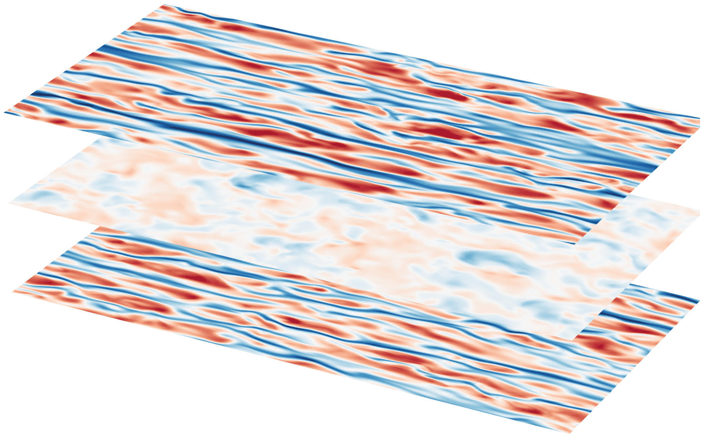
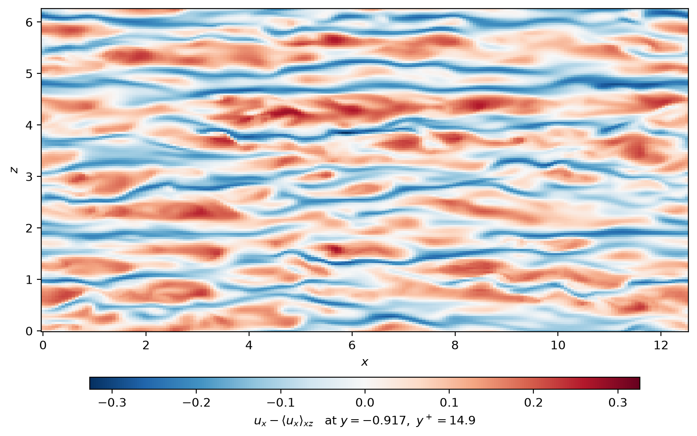

# dnsjax

**A GPU-accelerated pseudo-spectral solver for direct numerical simulation
of the 3D incompressible Navier–Stokes equations, written in
[JAX](https://github.com/jax-ml/jax).**


`dnsjax` integrates the incompressible Navier–Stokes equations by a
**pseudo-spectral** treatment of the periodic directions (Fourier)
combined with **banded finite differences** in up to one wall-bounded
direction, where an **influence-matrix method** reconciles
incompressibility with the wall boundary conditions — by default in a
reformulation that makes the stepped state's discrete divergence exact
to round-off. Because it is written in JAX, the same source runs on
**CPUs, GPUs, and TPUs**, on a single device or sharded across many, and
in single- or double-precision. Time advancement defaults to a
second-order, semi-implicit predictor–corrector scheme (an iterative
Crank–Nicolson); a Crank–Nicolson / Adams–Bashforth alternative trades
the corrector's stability margin for a single FFT evaluation per step.
The full formulation is in [`NUMERICS.md`](NUMERICS.md).

<p align="center">
  
</p>

<div align="center">

*Turbulent channel flow in a $4\pi \times 2\pi$ box at
$Re_\tau \approx 180$: streamwise velocity fluctuation on three
wall-parallel planes — near each wall, and at the centreline.
Red is faster than the local mean, blue slower.*

</div>

## Highlights

- **Nine flow systems across four geometries** — pipe, viscoelastic pipe,
  Taylor–Couette, quasi-Keplerian, Dean, viscoelastic Dean,
  plane-Poiseuille, plane-Couette, and Kolmogorov flow, all on one
  stepping core, the two nine-component viscoelastic (sPTT)
  conformation-tensor flows included.
- **Machine-precision discrete incompressibility, by default** — a stepped
  state's divergence sits at round-off *at any resolution*, on the same
  banded operators and with less operator storage than the classical
  scheme it replaces.
- **Runs anywhere JAX runs** — CPU, GPU, or TPU, on one device or many,
  in single or double precision, from the same code path.
- **Three analyses built on the solver itself** — non-modal optimal
  growth about an arbitrary wall-normal profile, lockstep twin runs for
  perturbation growth, and three interchangeable routes from a turbulent
  run to a data-driven linear operator.
- **45 standalone test scripts** pin the numerics, the machinery and the
  multi-device behavior, and the optimal-growth module reproduces
  published values for all five of its flows to about 2% or better — see
  [Testing and validation](#testing-and-validation).

## Flows and geometries

| Flow | Geometry | Laminar base / driving | Defining controls |
|---|---|---|---|
| **Pipe** | cylindrical | $U_z = 1 - r^2$, pressure-driven | `re`, axial length `lz` |
| **Viscoelastic Pipe** | cylindrical (sPTT) | axial body force, 9-component total field | `el`, `wi`, `beta`, `epsilon`, `kappa`, `lz` |
| **Taylor–Couette** | annular | $U_\theta = A_0 r + B_0/r$, wall rotation | `re1`, `re2`, `eta`, `lz` |
| **Quasi-Keplerian** | annular | $U_\theta = A_0 r + B_0/r$, Rayleigh-stable co-rotation | `re1`, `r_omega`, `eta`, `lz` |
| **Dean** | annular | azimuthal body force, total field | `re`, `eta`, `lz` |
| **Viscoelastic Dean** | annular (sPTT) | azimuthal body force, 9-component total field | `el`, `wi`, `beta`, `epsilon`, `kappa`, `delta`, `lz` |
| **Plane-Poiseuille** | Cartesian | $U = 1 - y^2$, pressure-driven | `re`, `lx`, `lz`, `tilt_degree` |
| **Plane-Couette** | Cartesian | $U = y$, wall-driven | `re`, `lx`, `lz`, `tilt_degree` |
| **Kolmogorov** | triply-periodic | $U = \sin(2\pi y / L_y)$, sine body force | `re`, `lx`, `lz`, `tilt_degree` |

Each flow exposes only the parameters that apply to it, under the names
natural to its geometry — a pipe takes `--geo.lz`/`--res.nr`/
`--res.ntheta` where a plane channel takes `--geo.lx`/`--res.ny`/
`--res.nz`. The Reynolds-number normalizations, the driving options, the
Taylor–Couette rotation conventions, the viscoelastic controls, the
azimuthal wedge and the tilted domains are collected under
[Conventions](NUMERICS.md#conventions).

## Installation

```bash
git clone https://github.com/gokhanyalniz/dnsjax.git
cd dnsjax
uv sync
```

The only prerequisite is [`uv`](https://docs.astral.sh/uv/): `uv sync`
provisions the pinned Python (3.14) by itself and installs the dependencies.
An MPI runtime (`mpirun`) is used to *launch* multi-process simulation runs,
but is not needed for a single-process run — one GPU, or one process
spanning a node's GPUs — nor for the installation or the post-processing
API. The default install pulls a CPU build of JAX. To run on
**CUDA GPUs**, replace `jax` with the CUDA-13 build:

```bash
uv add "jax[cuda13]"    # rewrites the jax requirement, re-locks, and re-syncs
```

(equivalently, change the `jax>=…` line in `pyproject.toml` to
`jax[cuda13]>=…` and run `uv sync`). The CUDA wheels are Linux x86-64 only.

### Faster CPU collectives (optional)

Across processes on CPU, JAX exchanges data over TCP (`gloo`) unless it can
route the collectives through MPI instead — which is faster, and which costs
a multi-process run nothing to arrange, being under `mpirun` by definition.
JAX embeds [MPItrampoline](https://github.com/eschnett/MPItrampoline) for
that but ships no MPI of its own, so it needs a thin wrapper built against
the machine's MPI:

```bash
git clone https://github.com/eschnett/MPIwrapper.git
cd MPIwrapper
cmake -S . -B build -DMPIEXEC_EXECUTABLE=mpiexec \
  -DCMAKE_BUILD_TYPE=RelWithDebInfo -DCMAKE_INSTALL_PREFIX=$HOME/mpiwrapper
cmake --build build
cmake --install build
export MPITRAMPOLINE_LIB=$HOME/mpiwrapper/lib/libmpiwrapper.so
```

A multi-device CPU run picks MPI up by itself once `MPITRAMPOLINE_LIB` is
set, or once `libmpiwrapper.so` sits on `LD_LIBRARY_PATH`, and prints which
backend it ended up with. Without the wrapper it stays on `gloo` and says so;
`JAX_CPU_COLLECTIVES_IMPLEMENTATION` overrides the choice either way. GPU
runs are unaffected — their collectives go through NCCL.

Every rank looks for the wrapper on its own filesystem, so export the
variable in the job script rather than relying on a path some nodes may not
mount: a node that cannot see the library falls back to `gloo` while its
peers take MPI, and the run then hangs. On macOS the search cannot fire at
all — it scans `LD_LIBRARY_PATH` for a `.so`, where macOS has
`DYLD_LIBRARY_PATH`, a `.dylib` convention, and SIP stripping that variable
from spawned processes — so set `MPITRAMPOLINE_LIB` explicitly there, and
expect to find out whether the macOS wheel carries the MPI collectives at
all, which is untested.

This works because nothing in a `dnsjax` run touches MPI before XLA does —
XLA initializes it without checking whether it is already up, so anything
that gets there first breaks the run. Worth knowing only if you add
something that might.

## Running a simulation

The example below runs a **100-diameter pipe at Re = 2300**, started from a
compact localized-roll perturbation, on a single CPU device. Every
problem-defining parameter — the physics, the geometry, the resolution, and
the time integrator — is written out explicitly, so switching to another flow
is a matter of editing values rather than learning the defaults.

A run that fits in one process is launched directly, with no MPI involved;
only a multi-process run goes through `mpirun -np N`, invoking the
environment's `dnsjax` console script directly — `uv run` does not compose
with `mpirun`, and `python -m dnsjax` is the equivalent module form. Output
files (`stats.dat`, snapshots, …) are written to the current directory, so
launch from a scratch directory:

```bash
.venv/bin/dnsjax \
  --phys.system pipe \
  --phys.re 2300 \
  --geo.lz 200 \
  --geo.grid_type half-cgl \
  --res.nz 512 --res.nr 48 --res.ntheta 96 --res.fd_order 8 \
  --step.scheme iterative-cn --step.dt 0.01 \
  --init.localized_rolls True \
  --init.localized_rolls_amplitude 0.2 --init.localized_rolls_width 2.0 \
  --stop.max_sim_time 500 \
  --outs.it_stats 100 --outs.it_snapshot 5000 \
  --dist.platform cpu
```

Every flow exposes only the parameters that apply to it, under the names
natural to its geometry — `dnsjax --help` lists the global parameters and
the implemented flows, `dnsjax --help pipe` the pipe's own surface, and
`dnsjax --sample-toml pipe` prints an annotated configuration template. A
parameter that does not belong to the selected flow is an error (on the
command line and in `parameters.toml` alike), not a silently ignored knob.

Reading the flags:

- `--phys.system pipe --phys.re 2300` — the flow and its Reynolds number.
- `--geo.lz 200` — the axial length is 100 pipe diameters ($D = 2$). The
  azimuthal extent is not settable: it is the full circle, or the
  $2\pi/m_0$ wedge when the `--geo.m0` symmetry restriction is used.
- `--geo.grid_type half-cgl` — the radial grid; `half-cgl` is the default
  for a pipe under `iterative-cn`, while `cnab2` uses `rigged-cgl` instead
  (both are halves of a Chebyshev grid that avoid the axis — see
  [Grids](NUMERICS.md#grids)).
- `--res.nz 512 --res.nr 48 --res.ntheta 96` — axial, radial, and azimuthal
  resolution, with eighth-order (the default) finite differences in the
  radial direction.
- `--step.scheme iterative-cn --step.dt 0.01` — the default
  predictor–corrector integrator at a wall-bounded-safe step.
- `--init.localized_rolls …` — a compact, deterministic finite-amplitude
  perturbation (peak amplitude 0.2) that seeds transition.
- `--stop.max_sim_time 500` — integrate 500 advective units past the
  initial condition, so here $t = 500$ (transition develops over
  $O(100)$ units; the run also stops early if the flow relaminarizes).
- `--dist.platform cpu` — a single CPU device.

`--init.localized_rolls` is one of **four start modes**, resolved in a
fixed precedence: a supplied `init.snapshot` wins over everything, then
`start_from_laminar` (the analytical base state), then
`localized_rolls`, then `random_field` — which is the **default**, so a
run with no snapshot and no explicit mode starts from a random
divergence-free field. The random builder takes
`--init.random_amplitude` / `_smoothness` / `_seed`, plus
`_conformation_amplitude` where it applies; the roll builder adds
`--init.localized_rolls_wavelength` to the amplitude and width shown
above. On the two plane channels the random field can also perturb the
$(k_x, k_z) = (0, 0)$ mean profile (`--init.random_mean_flow`, off by
default), conditioned on that mode's conservation laws — an unchanged
mean pressure gradient, which under no-slip is compatibility at both
walls, and an unchanged bulk velocity in each direction whose mean the
driving holds — so the perturbation reaches the mean flow without
contradicting what the run is holding fixed.
Every other flow declares the field and refuses it,
rather than appearing to offer something it does not implement. A path
given to `--init.snapshot` that is not a dnsjax snapshot **aborts**
rather than falling through to the random default, so a typo cannot
quietly start a different calculation.

Leave `--init.random_seed` unset and the run **draws one from the
system entropy pool**, prints it with its source, and records it in the
snapshot — so a batch of runs launched the same way explores different
realisations, and any one of them replays exactly by passing its
printed seed back. The same holds for `--twin.seed` and `--force.seed`.
A run that draws nothing (laminar, rolls, or a resume) never asks for
entropy; one that would draw and cannot reach a source stops rather
than falling back to a fixed value.

One default worth knowing: the pipe integrates in a frame translating at the
laminar bulk velocity $1/2$, and its snapshots are stored in that frame;
pass `--phys.u_grid 0` for the lab frame (see
[Temporal discretization](NUMERICS.md#temporal-discretization)).

This configuration fits comfortably in laptop memory — the
[Memory footprint](SCALING.md#memory-footprint) section shows how to
estimate any configuration. **Switching flows** is a one-line change:
`--phys.system taylor-couette --phys.re1 … --phys.re2 … --geo.eta …`, or
`--phys.system kolmogorov --geo.lx … --geo.lz …`, and so on per the table
above.

The same run can be expressed as a `parameters.toml` in the working
directory (shipped as the repository default):

```toml
[phys]
system = "pipe"
re = 2300            # bulk/diameter Reynolds number (= centerline/radius; D = 2)

[geo]
lz = 200.0           # axial length = 100 pipe diameters
# grid_type defaults to "half-cgl" for pipe + iterative-cn (auto-resolved)

[res]
nz = 512             # axial Fourier modes
nr = 48              # radial finite-difference points
ntheta = 96          # azimuthal Fourier modes
fd_order = 8

[init]
localized_rolls = true
localized_rolls_amplitude = 0.2   # peak |u'| of the perturbation
localized_rolls_width = 2.0       # axial localization half-width

[step]
dt = 0.01
scheme = "iterative-cn"

[outs]
it_stats = 100
it_snapshot = 5000

[stop]
max_sim_time = 500.0
# check_laminarization = true (default) stops the run if the flow relaminarizes
```

What to expect while it runs: the code's git revision, the final working
parameters, and the physical-space resolution are printed at startup, the
first step takes noticeably longer than the rest (JIT compilation), and a
timing summary is printed at the end. Statistics stream to `stats.dat`
(with `steps.dat` and `corrector.dat` for the CFL and corrector
diagnostics), and snapshots appear as `state00000.tar` (the initial
condition), `state00001.tar`, and so on. Runs end gracefully — at
`max_sim_time`, at an ISO 8601 `stop.max_wall_time` budget (writing a
final snapshot first), on relaminarization, or on SIGTERM/SIGINT (flushing
the diagnostic buffers) — so interrupted runs stay consistent with their
outputs; a NaN or inf in any diagnostic instead aborts the run at once
with a line naming the quantity, rather than spending the budget on a
broken state.

Each `.dat` stream opens with a `#`-commented header row naming its
columns (`t` first) — so `np.loadtxt` reads one directly — and is
appended to across resumes. `stats.dat` carries the
flow's physical diagnostics: the perturbation and total kinetic
energies `E'` and `E`, and the energy input rate `I` against the
dissipation `D`, which satisfy $dE/dt = I - D$ to truncation order —
a closure the test suite pins. The wall-bounded flows add per-wall
shear stresses and bulk velocities under the names natural to the
geometry (`tau'_s,b`/`tau'_s,t` and `Ub'_s`/`Ub'_n` in the channels,
`tau'_z`/`tau'_th` in the pipe, inner/outer pairs in the annulus),
primed on the flows that evolve a perturbation and unprimed on the
three that integrate the total field. The viscoelastic flows report
the solvent dissipation `D_s` in place of `D` and add the polymer
work `W_p`, the elastic energy `E_p`, and the mean conformation
trace `TrC`. A run holding a bulk velocity or a mean
spanwise velocity fixed appends one further column per constrained
direction (`-dPds'` / `-dPdn'` / `-dPdz'`): the mean-mode **forcing**
the corrector applied over that step, positive when accelerating. Two
optional binary streams — a spectral-mode probe stream and a
stochastic-forcing log — are available through the `[probes]` and
`[force]` sections; see
[`src/dnsjax/extensions`](src/dnsjax/extensions/README.md).

## What's in the box

Beyond the core solver, in the order a run tends to meet them:

1. **Non-modal optimal-growth analysis.** `dnsjax.analysis.transient_growth`
   computes 3D linear optimal energy growth $G(t)$ around an arbitrary
   wall-normal total profile for the pipe, Taylor–Couette, quasi-Keplerian,
   plane-Poiseuille, and plane-Couette flows, reusing the solver's own
   linear step for each Fourier mode. It runs on a single device
   (GPU-capable) and reproduces published optimal-growth values for all
   five flows to about 2% or better.

   ```bash
   python -m dnsjax.analysis.transient_growth --help
   ```

2. **A custom banded-LU GPU kernel with a dense reference solver.** The
   per-mode wall-normal solves store $O(N_y p)$ banded LU factors instead
   of the dense $O(N_y^2)$, swept on GPU by a custom Pallas/Triton kernel
   and on CPU by the same banded math as a sequential pure-JAX sweep; a
   dense reference solver validates both numerically. Kernels are checked
   both in Pallas interpret mode and by lowering to CUDA on CPU-only
   machines.

3. **Multi-device sharding on CPU/GPU/TPU.** A two-axis $(n_{p0}, n_{p1})$
   device mesh with an in-FFT reshard pipeline distributes the work while
   keeping the wall-normal solves communication-free — see
   [Parallelization](SCALING.md#parallelization).

4. **A memory–throughput dial for the nonlinear term.**
   `solver.rhs_transform_chunks = k` splits the batched inverse transform of
   the pseudo-spectral right-hand side into $k$ balanced groups, cutting its
   transform-stage working set roughly $k$-fold at identical results — see
   [Memory footprint](SCALING.md#memory-footprint). The default `1` keeps
   the single fused batch, which is throughput-optimal (one FFT dispatch and one
   reshard round per pipeline stage); raise it to fit a memory-bound run,
   most effectively for the viscoelastic flows, whose 36-field batch
   dominates the step's peak.

5. **Standard-tools-readable snapshots and a JAX-free reader.** The tar +
   zarr3 format — written in parallel, directly from GPU memory when
   GPUDirect Storage is available — and the NumPy-only `read_state` cleanly
   separate the runtime from the analysis API — see
   [Snapshots and external data access](#snapshots-and-external-data-access).

6. **Robust resume.** Snapshots resume across any device count
   (precision must match), re-grid every changed axis on load — the
   wall-normal grid by interpolation, the Fourier axes by padding or
   truncating modes — and track lineage, including the recording code's
   git revision, echoed at startup when resuming — distinguishing a
   genuine continuation from a new trajectory when the physics, geometry
   or resolution changes.

7. **Laminarization auto-stop.** A run terminates automatically once the
   perturbation energy drops below `stop.laminarization_threshold`, so
   relaminarization events are captured without babysitting — natural for
   lifetime and edge-of-chaos studies.

8. **Initial-condition generators.** Divergence-free random fields (the
   default start mode) and deterministic, compactly localized "turbulent
   spots" are both built in, sharded and reproducible independent of the
   device count.

9. **Moving frame of reference.** The `u_grid` parameter integrates the flow
   in a frame translating along the streamwise / axial direction, implicitly
   in both time schemes — convenient for following traveling structures. It
   defaults to the laminar bulk velocity ($1/2$ both pipes, $2/3$
   plane-Poiseuille, zero otherwise); set it to `0` for the lab frame.

10. **Buffered, crash-consistent diagnostics with a non-finite guard.**
    Statistics, CFL, and corrector diagnostics stream to `stats.dat`,
    `steps.dat`, and `corrector.dat`, buffered on-device and flushed
    before snapshots and on termination so they stay consistent with the
    saved state. Every flushed value is checked: a NaN or inf aborts the
    run with one line naming the quantity (exit code 3), keeping the
    offending rows on disk for post-mortem and writing no snapshot of the
    broken state.

11. **Wall-time-aware graceful shutdown.** `stop.max_wall_time` takes an
    ISO 8601 duration and ends the run cleanly — final statistics, a final
    snapshot, flushed diagnostics — before a queue kills it, and
    SIGTERM/SIGINT are caught and flush the diagnostic buffers.

12. **External-data import.** `scripts/snapshot_import.py` is a small
    library that packs a velocity field produced elsewhere into a valid
    snapshot, so external data enters the solver and the analysis API as a
    first-class state.

13. **Adaptive CFL time stepping.** `step.adaptive` re-selects the time
    step at runtime from the measured CFL (setpoint `cfl_target`,
    bounds `dt_min`/`dt_max`, per-change limiters and a deadband),
    rebuilding the $\Delta t$-dependent implicit operators on the device
    with no recompilation and, under `cnab2`, ratio-weighting the next
    Adams–Bashforth step — see
    [Temporal discretization](NUMERICS.md#temporal-discretization).

14. **Machine-precision discrete incompressibility, by default.** Every
    wall-bounded flow advances the wall-normal velocity and vorticity and
    reconstructs the tangential components, eliminating the discrete
    pressure — the stepped state's divergence is round-off at any
    resolution, on the same banded operators and with less operator
    storage, and both the energy budget and the temporal convergence
    close tighter than under the primitive scheme. That primitive
    $(\mathbf{u}, p)$ path remains selectable (`res.consistent_imm =
    false`) for reference; changing the setting on resume starts a new
    trajectory — see
    [The influence-matrix method](NUMERICS.md#the-influence-matrix-method).

15. **Twin-run perturbation-growth driver.** `dnsjax-twin` (Cartesian
    wall-bounded flows, fixed step) steps a reference snapshot and a
    perturbed copy (a random divergence-free field of prescribed energy
    $E_\Delta(0)$, exact in the solver's own measure) through the same
    jitted stepper in lockstep and streams diagnostics of the
    difference field: its total energy; the componentwise
    wall-normal-resolved spectra $E_\Delta(y, k_z)$ and
    $E_\Delta(y, k_x)$ together with the matching spectral budget —
    production against the reference mean profile and against its
    fluctuations, transfer by each field, the viscous term in both
    forms, and the pressure work, the one term a $y$-resolved budget
    cannot omit; and time-resolved $(k_z, k_x)$ energy spectra for
    scale-by-scale decorrelation. A mean/streak/streamwise-varying
    three-bin decomposition and its 24 production/transport terms plus 3
    dissipations are available too (`twin.bins`, off by default: the
    split is a partition of the $(k_x, k_z)$ plane that its authors
    restrict to minimal flow units, and the $(y, k)$ streams recover its
    three energies exactly). The three per-state streams a plain solver
    run writes — statistics, CFL and corrector — are recorded for
    *both* states at the usual cadences, the partner's under a `_twin`
    suffix, so each state's own applied mean-mode driving is on record
    and their difference is an offline subtraction. Paired snapshots
    make members restartable;
    `ensemble_setup.py build-twin` and the JAX-free
    `dnsjax.analysis.twin` package orchestrate and aggregate ensembles.
    A zero-energy perturbation reproduces the reference bit-for-bit,
    every stream pair included —
    the determinism guard the test suite pins. Streams, knobs, and the
    resume bookkeeping:
    [`src/dnsjax/twin`](src/dnsjax/twin/README.md).

16. **Response analysis and system identification.** A run can record
    the wall-normal profiles of chosen spectral modes as it evolves
    (`[probes]`) and can be driven by white-in-time stochastic kicks at
    those modes (`[force]`) — see
    [`src/dnsjax/extensions`](src/dnsjax/extensions/README.md).
    `dnsjax.analysis.response` builds on both: the turbulent mean
    profile, the linear operator about *that* mean, its leading
    controllability modes, and three interchangeable routes to a
    data-driven generator — ensemble impulse responses, linear inverse
    modeling from an unforced stream, or stochastic-forcing
    identification — sharing one basis and output convention so the
    results are directly comparable. See
    [`src/dnsjax/analysis/response`](src/dnsjax/analysis/response/README.md).

## Parameter layering

Configuration is applied in layers, lowest priority first:

**Per-flow defaults → parameters embedded in a resumed snapshot →
`parameters.toml` → command-line flags.**

Only explicitly set fields override a lower layer, and validation runs once
after the final layer. Every layer is parsed against the **selected flow's
parameter surface**: only that flow's parameters exist (an irrelevant key is
a hard error naming the flow), fields go by their geometry-natural public
names (a pipe has `--geo.lz`/`--res.nz`/`--res.nr`/`--res.ntheta` where a
plane channel has `--geo.lx`/`--res.nx`/`--res.ny`/`--res.nz`), and per-flow
defaults (the pipe's moving frame `u_grid = 0.5`, its scheme-dependent
`grid_type`, the viscoelastic rheology values) are materialized before
printing or recording. The parameters that must be known before JAX
initializes — `dist.np0`, `dist.np1`, `dist.platform`, and
`res.double_precision` — are never inherited from a snapshot, nor are the
resume-decision fields `init.snapshot` and `init.force_resume` (recorded
for lineage only), and the entire `solver` section is execution-only.

Not every section is owned by the core parameter model. An
**extension** registers a whole section of its own — parsed as
`--<name>.<field>` and `[<name>]`, shown in `--help` and
`--sample-toml`, validated strictly per flow (a section on a flow it
does not apply to is an error like any other irrelevant key),
optionally recorded into snapshot metadata, and optionally
trajectory-defining. Two ship with the solver, `[probes]` and
`[force]`; the analysis and preprocessing entry points register their
own on the same shared surface (`[tg]` for the transient-growth CLI,
`[perturb]` for `scripts/snapshot_perturb.py`, `[twin]` for
`dnsjax-twin`). A section name colliding with a core one is rejected
at registration, so the two namespaces cannot drift into each other.

`uv run dnsjax --help` shows the global parameters and the flow list,
`--help <system>` one flow's full surface with per-field descriptions, and
`--sample-toml <system>` an annotated `parameters.toml` template with every
default commented out (all exit at the parser, before any device is
touched). The
authoritative field-by-field documentation lives in
[`src/dnsjax/parameters.py`](src/dnsjax/parameters.py) and the per-flow
specs under `src/dnsjax/flows/*/specs/`.

## Architecture

One time step: the spectral state is inverse-transformed onto the
$\tfrac{3}{2}$-oversampled grid, the rotational nonlinear term is formed
pointwise, and the result is transformed back and truncated — two
reshards carry the data across the $(n_{p0}, n_{p1})$ device grid each
way. A semi-implicit predictor is then corrected toward the
Crank–Nicolson fixed point, each iteration solving one banded system per
Fourier mode. Every device holds the full wall-normal extent in spectral
space, so those solves need no communication at all; a snapshot write
reshards once more, onto a layout whose byte ranges are contiguous per
device.

<picture>
  <source media="(prefers-color-scheme: dark)"
          srcset="docs/figures/step-pipeline-dark.svg">
  
</picture>

Array layout per geometry, the memory footprint of a configuration as a
symbolic formula linear in $n_x n_y n_z$, and how to choose the device
grid — whose two exchanges are *not* equivalent, so the choice matters:
[`SCALING.md`](SCALING.md). The equations, the discretization, the two
time schemes and the influence-matrix method:
[`NUMERICS.md`](NUMERICS.md).

## Snapshots and external data access

A snapshot is a **single uncompressed tar archive** (format version 6)
wrapping a **zarr3** store, a JSON metadata member (parameters, grid,
lineage, and the writing code's git revision), and one contiguous chunk
per state component (three velocity components, or nine for the
viscoelastic flows). Each chunk is stored **in the solver's native
spectral layout** at true (unpadded) mode counts — saving, loading, and
reading never transpose — and in **physical components** for every
geometry: the cylindrical and annular families convert from the
solver's decoupled $u_\pm$/spin working basis at the write/read
boundary. The embedded parameters are the flow-relevant,
resolved values under their public names — the same representation the
startup printout and `--sample-toml` use; snapshots written before
format version 6 embed a different layout, basis, or representation and
are rejected rather than translated. A write first reshards the state,
inside `jit`, onto the file's own layout — a contiguous wall-normal
slab per device, at the true mode counts, so the padding never reaches
the file — and each device then writes its disjoint byte ranges, one
per component, into the one file in parallel: directly between GPU
memory and disk when GPUDirect Storage is available, through the host
otherwise, with a
concurrent mode for POSIX/parallel filesystems and a rank-ordered
serial mode for filesystems where concurrent writes are unsafe. The
bytes land in `<name>.tar.partial` and are renamed into place only once
complete, so a killed job leaves the previous snapshot intact and never
a truncated archive that could pass for a valid one; on read, the chunk
layout is checked against the metadata, and a damaged archive raises an
error naming the file and the cause.
The stored field is the spectral **perturbation** $\mathbf{u}'$ for the
base-flow systems (the laminar state is a zero array) and the **total**
field for Dean, viscoelastic Dean, and the viscoelastic pipe. The archive
is readable with ordinary tools — `tar xf` yields a valid zarr3 store,
and in the worst case each
chunk is raw little-endian complex data for `numpy.fromfile`. Resume is
agnostic to the device count (precision must match — a mismatch
rejects), and re-grids **every changed axis** on load: the wall-normal
grid by interpolation — spectrally when both grids are CGL-family, by a
local order-`fd_order` stencil for tanh or custom grids — and each
Fourier axis by inserting or dropping modes at its high-wavenumber end,
so a state can be picked up at a different resolution (which, being a
`res` change, starts a new trajectory rather than continuing one).
`stop.max_sim_time` is a horizon measured from the run's own initial
condition rather than an absolute clock reading, so a resume asks for
that much *more* integration whatever time the snapshot carries — one
value serves an ensemble whose members were harvested at different
times. A run split across several launches therefore gets the whole
horizon again at each one; a fixed absolute end time is expressed by
shortening `max_sim_time` on the resume.

For post-processing, `dnsjax.analysis.snapshot_export.read_state` reads a
snapshot into NumPy arrays **without importing JAX or the solver runtime**,
pulling only the requested data off disk:

```python
from dnsjax.analysis.snapshot_export import read_state

data = read_state("state00001.tar")   # NumPy only — no JAX, no solver
u_z, u_r, u_theta = data.physical     # pipe: real fields, native (r, θ, z)
r, theta, z = data.physical_coords    # matching coordinate arrays
re = data.params.phys.re              # embedded parameters

# Cartesian systems return (u_x, u_y, u_z) in the native (y, z, x) layout:
u_x, u_y, u_z = read_state("state00002.tar").physical

# Select components, read just two wall-normal slabs off disk, and also
# return the spectral coefficients:
data = read_state(
    "state00001.tar",
    components=(0,),
    wall_normal_points=(0.2, 0.8),
    return_spectral=True,
)
```

Both README figures are made this way — no JAX, no solver runtime, just
a snapshot and NumPy (`scripts/snapshot_figure.py`):

<p align="center">
  
</p>
<div align="center">

*The same run, read back through `read_state`: streamwise velocity
fluctuation in a wall-parallel plane at $y = -0.917$, $y^+ = 14.9$ —
the height at which it peaks.*

</div>

The companion `dnsjax.analysis.snapshot_ops` module provides `derivative`,
`gradient`, `divergence`, `curl`, and `integrate` that reproduce the
solver's *discrete* operators node-for-node, plus `to_physical` and
`to_spectral` for moving a field between the two representations.

Four more names round out the JAX-free API for the cases where the
field data is not what you are after. `read_meta` returns a snapshot's
parsed metadata — resolution, grid, clock, lineage, the writing code's
git revision — and `read_stats` the physical diagnostics of the state
itself, which every snapshot carries as its own archive member unless
`outs.snapshot_embed_stats` is turned off.
`geometry_info` turns those parameters into the per-geometry axis and
component schema, and `Namespace` is the read-only view they are
returned through: it gives attribute access (`params.phys.re`) and item
access side by side, the latter for stats keys such as `E'` or
`tau'_s,b` that are not valid Python identifiers.

`scripts/snapshot_import.py` covers the reverse direction: packing a
velocity field produced elsewhere (by another simulator, say) into a
valid snapshot — velocity flows only, the nine-component viscoelastic
state being readable but not importable.

The importer is a library (not a CLI) and **assumes the field is already
in dnsjax's native layout**: components leading, axes $(y, z, x)$ for the
Cartesian and triply-periodic systems and $(r, \theta, z)$ for the
cylindrical and annular flows (pipe, Taylor–Couette, quasi-Keplerian,
Dean) — whose components are $(u_z, u_r, u_\theta)$ — so any axis
permutation and component reordering from the source code's conventions
is the caller's first step.
Two conventions to keep in mind. The resolutions are the solver's
nominal (physical) mode counts *without* the 3/2 dealiasing expansion —
never include dealiasing zero-padding in the field or the resolution
parameters. And every wall-bounded flow needs its wall-normal/radial
grid points, **ascending** in dnsjax's convention: bottom wall $-1$ to
top wall $+1$ (Cartesian), near-axis to the outer wall on $(0, 1]$
(pipe), inner to outer radius (Taylor–Couette); the triply-periodic
systems take no grid. Parameters go by the flow's public names, exactly
as on the CLI:

```python
import sys

import numpy as np

sys.path.insert(0, "scripts")   # snapshot_import is a library, not a CLI
from snapshot_import import convert_field_to_snapshot

# Plane-Couette: perturbation u' with components (u_x, u_y, u_z) over
# native axes (y, z, x) — shape (3, ny, nz, nx) — already in dnsjax's
# layout, sampled on the ascending wall-normal grid ys of length ny.
u = np.load("external_field.npy")           # (3, 65, 128, 128)
ys = -np.cos(np.linspace(0.0, np.pi, 65))   # CGL: -1 (bottom) → +1 (top)
convert_field_to_snapshot(
    u, "ic_plane_couette.tar",
    system="plane-couette", nx=128, ny=65, nz=128,
    lx=4.0, lz=4.0, wall_normal_grid=ys, re=400.0,
    space="physical",
)

# Pipe: (u_z, u_r, u_θ) over (r, θ, z), shape (3, nr, ntheta, nz); lz
# is the axial period (the sole free length — the azimuthal extent is
# the wedge 2π/m0), and rs ascends over the radii on (0, 1].
convert_field_to_snapshot(
    u_pipe, "ic_pipe.tar",
    system="pipe", nz=96, nr=49, ntheta=128,
    lz=6.0, m0=1, wall_normal_grid=rs, re=3000.0,
    space="physical",
)

# Taylor-Couette: same layout and resolution names as the pipe, driven
# by re1/re2/eta; rs_tc ascends from r_in = η/(1−η) to r_out = 1/(1−η).
convert_field_to_snapshot(
    u_tc, "ic_taylor_couette.tar",
    system="taylor-couette", nz=64, nr=49, ntheta=128,
    lz=4.0, wall_normal_grid=rs_tc,
    re1=400.0, re2=-200.0, eta=0.875,
    space="physical",
)
```

`space="spectral"` accepts already-transformed input in the same axis
order, with one restriction on where the half spectrum may sit: only the
**last** axis (the streamwise `nx` / axial `nz` slot) is the real-FFT
axis, holding the `nx//2` non-negative modes (Nyquist optional, dropped);
the other Fourier axes must carry full two-sided spectra, and
`input_norm` names the source's FFT normalization. A source that
`rfft`-ed a different axis must be permuted so its half axis lands last.
The result is an ordinary snapshot: start a run from it with
`--init.snapshot ic_plane_couette.tar` (a wall-normal grid differing from
the run's is re-gridded at load).

## Extending

Adding a flow system is a two-file operation. The first is a
**`FlowSpec`** under `src/dnsjax/flows/<family>/specs/`, added to that
package's `SPECS` tuple; the second is the flow module it names, which
exports the stepping surface. Nothing else is edited: the
`phys.system` literal, the `--help` and `parameters.toml` surfaces,
`--sample-toml`, the snapshot metadata surface, the stepping dispatch
and the analysis package's geometry sets all derive from the registry
and extend themselves.

A spec is plain data plus pure-Python hooks. It declares which shared
parameter fields apply to the flow, the public names of any aliased
ones (`nr` for the internal `res.ny`, and so on), per-flow default
overrides, narrowed choice sets, *deferred* fields — declared but not
yet implemented, so they fail with their own message rather than
looking nonsensical — and the flow's derivation and validation hooks.
A state that is not three velocity components declares its count, and
the initial-condition builders, the FFT and sharding layers, and the
steppers are all component-count-agnostic.

Specs import nothing heavier than the standard library: no pydantic,
no JAX, and never the parameter module itself, whose live objects the
hooks receive as arguments. That is what lets `--help` render and a
TOML validate without configuring JAX, and what keeps the import graph
acyclic.

The other extension point is the parameter surface itself: a script or
analysis tool registers a whole section of its own, as described under
[Parameter layering](#parameter-layering).

## Testing and validation

The test suite is 45 standalone scripts under `tests/`, run directly
(`uv run python tests/test_cartesian.py`) or through the optional pytest
bridge — `uv run pytest` shells each script out as a subprocess, with
`mpi`/`slow` markers and the scripts staying the source of truth — and
several of them launch real `mpirun` multi-device runs. Among the
guarantees they pin:

- **Solvers and operators** — the Pallas banded kernel against a dense
  reference solver, per-geometry operators and matvecs against NumPy
  constructions, and CUDA-lowering guards that catch Triton compilation
  regressions on CPU-only machines.
- **The physics** — laminar states step at machine precision, random
  initial conditions integrate through the full nonlinear path for every
  distinct stepping machinery (seven of the nine flows; the other two
  bind machinery those seven cover), localized spots integrate for every
  wall-bounded spot builder, and second-order temporal convergence is
  pinned — absolute on the periodic box, scheme-against-scheme for the
  wall-bounded systems, whose absolute order the projection splitting
  sets. A separate self-convergence study asserts that the default
  formulation strictly improves both that absolute error and its decay
  rate over the primitive one, in all three wall-bounded geometries.
- **The machinery** — snapshot round-trips readable by standard tools,
  device-count-agnostic resume with lineage checks, and the JAX-free
  import guarantee of the analysis API.
- **Physical validation** — the transient-growth module reproduces published
  optimal-growth values for all five of its flows to about 2% or better.

`scripts/` adds benchmark and diagnostic tools: `solver_benchmark.py`
(Pallas-vs-dense validation and benchmark, including multi-GPU),
`pallas_solve_profile.py` (where the banded solve's time goes),
`pallas_tiling_diagnostic.py` (a GPU miscompile-isolation harness), and
`gds_probe.py` (whether the GPUDirect Storage snapshot path is engaged,
and what starves it).

It also holds three offline tools. `wall_normal_resolution.py` answers
how many wall-normal modes a finite-difference grid actually resolves,
by measuring the wall-normal Laplacian's eigenvalue spectrum against
that of a Chebyshev expansion of a given order — so a spectral-in-$y$
setup from the literature can be sized in `res.ny` and `res.fd_order`
before a run rather than after. `snapshot_perturb.py` injects a scaled
single-mode perturbation into an existing snapshot — from a
transient-growth optimal, a controllability-mode bundle, or a raw
profile — and keeps the parent's `t`/`it`, so a run resumed from the
result continues the parent's trajectory with the perturbation applied;
it runs single-device on the snapshot's own parameters and precision, so
every mode it does not touch round-trips bit-identically.
`ensemble_setup.py` builds ensembles of such runs; those two are covered
under [Response analysis](src/dnsjax/analysis/response/README.md). Two of
the three — `wall_normal_resolution.py` and `ensemble_setup.py` — need no
JAX at all, as do the two figure scripts, `twin_spectral_maps.py` and
`snapshot_figure.py`, which draw the twin spectra and a snapshot's
velocity plane on NumPy and matplotlib alone.

## Documentation map

| file | what it covers |
|---|---|
| this README | flows, installation, running, what is in the box, snapshots, extending, testing |
| [`NUMERICS.md`](NUMERICS.md) | the equations, the spatial and temporal discretization, the wall-normal grids, the influence-matrix method, and the per-flow conventions |
| [`SCALING.md`](SCALING.md) | array layout by geometry, the memory model, and how to choose the $(n_{p0}, n_{p1})$ device grid |
| [`src/dnsjax/extensions`](src/dnsjax/extensions/README.md) | the `[probes]` and `[force]` runtime streams |
| [`src/dnsjax/analysis/response`](src/dnsjax/analysis/response/README.md) | probe stream → turbulent mean → linear operator → identification |
| [`src/dnsjax/twin`](src/dnsjax/twin/README.md) | the `dnsjax-twin` lockstep driver, its streams and its ensembles |

Field-by-field parameter documentation lives in the code and is rendered
per flow by `dnsjax --help <system>` and `dnsjax --sample-toml <system>`.

## References

The numerics follow these references:

- A. P. Willis, *The Openpipeflow Navier–Stokes solver*, SoftwareX **6**,
  124–127 (2017). Predictor–corrector time stepping and the decoupled
  $u_\pm$ pipe/annular formulation.
- L. Kleiser and U. Schumann, *Treatment of incompressibility and boundary
  conditions in 3-D numerical spectral simulations of plane channel flows*,
  in *Proc. 3rd GAMM Conference on Numerical Methods in Fluid Mechanics*,
  165–173, Vieweg (1980). The influence-matrix method.
- B. Fornberg, *Calculation of weights in finite difference formulas*, SIAM
  Review **40**(3), 685–691 (1998). Finite-difference weights on non-uniform
  grids.
- L. N. Trefethen, *Spectral Methods in MATLAB*, SIAM (2000). Clenshaw–Curtis
  quadrature and spectral differentiation.
- J. A. C. Weideman and S. C. Reddy, *A MATLAB differentiation matrix suite*,
  ACM Trans. Math. Softw. **26**(4), 465–519 (2000). Differentiation and
  interpolation matrices.
- N. Phan-Thien and R. I. Tanner, *A new constitutive equation derived from
  network theory*, J. Non-Newtonian Fluid Mech. **2**(4), 353–365 (1977). The
  (simplified) Phan-Thien–Tanner viscoelastic model.

## License and citation

Released under the [MIT License](LICENSE), © 2025 Gökhan Yalnız. If `dnsjax`
supports your work, a citation of this repository
(<https://github.com/gokhanyalniz/dnsjax>) is appreciated.

## Use of AI

The first version of this solver — the triply-periodic geometry, the
predictor–corrector stepper, and the Kolmogorov flow — was designed and
written entirely by hand. The extension to the wall-bounded geometries grew
out of that core design with extensive use of LLM coding assistants.
Throughout, the design, the numerical formulation, and the validation
strategy are the author's, and every assisted change was planned, reviewed,
and iterated on by the author, with correctness checked against the test
suite.
