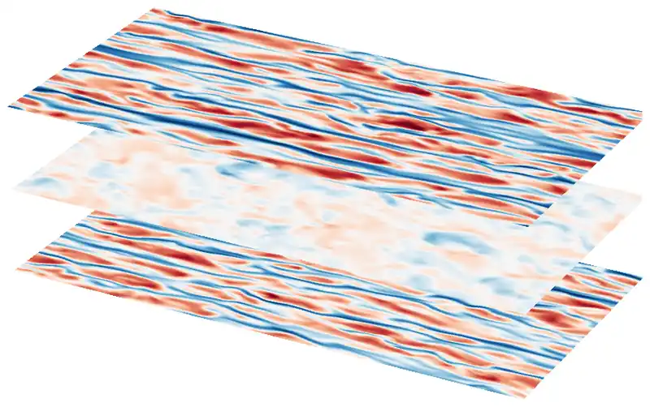
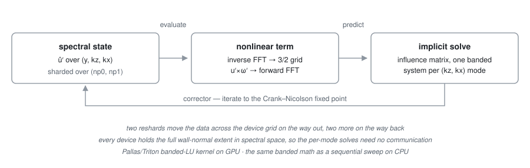

# dnsjax

**A GPU-accelerated pseudo-spectral solver for direct numerical simulation
of the 3D incompressible Navier–Stokes equations, written in
[JAX](https://github.com/jax-ml/jax).**

[](https://github.com/gokhanyalniz/dnsjax/actions/workflows/ci.yml?query=branch%3Amain)


Periodic directions are **pseudo-spectral** (Fourier); up to one
wall-bounded direction uses **banded finite differences**, where an
**influence-matrix method** reconciles incompressibility with the wall
boundary conditions — by default in a reformulation that makes the
stepped state's discrete divergence exact to round-off. Nine flow systems
across four geometries share one stepping core, on **CPU, GPU or TPU**,
one device or many.

<a id="fig-planes"></a>
<p align="center">
  
</p>

<p align="center"><em>
Turbulent channel flow at Re<sub>&tau;</sub> &asymp; 180: streamwise
velocity fluctuations on three wall-parallel planes &mdash; near each
wall, and at the centreline &mdash; over 10 advective time units.<br>
<a href="docs/snapshots.md#fig-streaks">&#128279;&nbsp;See one near-wall
plane by itself.</a>
</em></p>

**Contents** — [Highlights](#highlights) ·
[Quick start](#quick-start) ·
[Flows and geometries](#flows-and-geometries) ·
[Performance and scaling](#performance-and-scaling) ·
[Validation](#validation) ·
[Design decisions](#design-decisions) ·
[What's in the box](#whats-in-the-box) ·
[Documentation](#documentation) ·
[Testing](#testing) ·
[Extending](#extending) ·
[Limitations](#limitations) ·
[References](#references) ·
[License and citation](#license-and-citation) ·
[Use of AI](#use-of-ai)

## Highlights

- **Runs anywhere JAX runs** — CPU, GPU or TPU, one device or many,
  single or double precision, from the same code path; the wall-normal
  solves go through a custom Pallas/Triton banded-LU kernel on GPU.
- **Machine-precision discrete incompressibility, by default** — a
  stepped state's divergence sits at round-off *at any resolution*, on
  the same banded operators and with less operator storage than the
  classical scheme it replaces.
- **Nine flow systems across four geometries** on one stepping core, the
  two nine-component viscoelastic (sPTT) flows included.
- **Three analyses built on the solver itself** — non-modal optimal
  growth, lockstep twin runs for perturbation growth, and three
  interchangeable routes from a turbulent run to a data-driven linear
  operator.
- **Post-processing that needs no solver** — snapshots are ordinary tar
  archives wrapping a zarr3 store, and the reading API imports nothing
  but NumPy.

## Quick start

```bash
git clone https://github.com/gokhanyalniz/dnsjax.git
cd dnsjax
uv sync
```

The only prerequisite is [`uv`](https://docs.astral.sh/uv/), which
provisions the pinned Python (3.14; 3.12 is the floor) by itself. The
default install pulls a CPU build of JAX; for **CUDA GPUs** run
`uv add "jax[cuda13]"` (Linux x86-64 wheels only). An MPI runtime is
needed only to *launch* a multi-process run — not for a single process
spanning a node's GPUs, and not for the post-processing API. On
multi-process CPU runs, MPI can also carry the collectives:
[`docs/cpu-collectives.md`](docs/cpu-collectives.md).

Output goes to the working directory, so launch from a scratch dir:

```bash
mkdir -p /tmp/run && cd /tmp/run
/path/to/dnsjax/.venv/bin/dnsjax \
  --phys.system pipe --phys.re 2500 --geo.lz 8 \
  --phys.driving constant_bulk_velocity \
  --res.nz 24 --res.nr 32 --res.ntheta 32 \
  --init.localized_rolls True \
  --init.localized_rolls_amplitude 0.3 --init.localized_rolls_width 1.5 \
  --step.dt 0.01 --stop.max_sim_time 200 \
  --outs.it_stats 50
```

Four diameters of pipe at Re = 2500, seeded with a localized roll
("puff") that breaks down into turbulence and decays again a hundred or
so advective time units later — a few minutes on one core. The first
step takes noticeably longer than the rest (JIT compilation);
statistics then stream to `stats.dat`. The same run as a configuration
file is
[`examples/pipe-re2500/parameters.toml`](examples/pipe-re2500/parameters.toml),
and [`examples/`](examples/) has three more — a plane channel, a minimal
Couette cell and a triply-periodic box — each sized to reach turbulence
on one laptop core.

`dnsjax --help` lists the global parameters and the flows, `--help pipe`
one flow's full surface, and `--sample-toml pipe` an annotated template.
The flag-by-flag walkthrough, the four start modes, the seed contract
and the output streams: [`docs/running.md`](docs/running.md).

## Flows and geometries

| Flow | Geometry | Laminar base / driving | Defining controls |
|---|---|---|---|
| **Pipe** | cylindrical | $U_z = 1 - r^2$, pressure-driven | `re`, axial length `lz` |
| **Viscoelastic Pipe** | cylindrical (sPTT) | axial body force, 9-component total field | `el`, `wi`, `beta`, `epsilon`, `kappa`, `lz` |
| **Taylor–Couette** | annular | $U_\theta = A_0 r + B_0/r$, wall rotation | `re1`, `re2`, `eta`, `lz` |
| **Quasi-Keplerian** | annular | $U_\theta = A_0 r + B_0/r$, Rayleigh-stable co-rotation | `re1`, `r_omega`, `eta`, `lz` |
| **Dean** | annular | azimuthal body force, total field | `re`, `eta`, `lz` |
| **Viscoelastic Dean** | annular (sPTT) | azimuthal body force, 9-component total field | `el`, `wi`, `beta`, `epsilon`, `kappa`, `delta`, `lz` |
| **Plane-Poiseuille** | Cartesian | $U = 1 - y^2$, pressure-driven | `re`, `lx`, `lz`, `tilt_degree` |
| **Plane-Couette** | Cartesian | $U = y$, wall-driven | `re`, `lx`, `lz`, `tilt_degree` |
| **Kolmogorov** | triply-periodic | $U = \sin(2\pi y / L_y)$, sine body force | `re`, `lx`, `lz`, `tilt_degree` |

Each flow exposes only the parameters that apply to it, under the names
natural to its geometry: a pipe takes `--geo.lz`/`--res.nr`/`--res.ntheta`
where a plane channel takes `--geo.lx`/`--res.ny`/`--res.nz`. Reynolds-number
normalizations, driving options, rotation conventions, the viscoelastic
controls and the azimuthal wedge are collected under
[Conventions](docs/numerics.md#conventions).

## Performance and scaling

One time step: the spectral state is inverse-transformed onto the
$\tfrac{3}{2}$-oversampled grid, the rotational nonlinear term is formed
pointwise, and the result is transformed back and truncated — two
reshards carry the data across the device grid each way. A semi-implicit
predictor is then corrected toward the Crank–Nicolson fixed point, each
iteration solving one banded system per Fourier mode. **Every device
holds the full wall-normal extent in spectral space, so those solves need
no communication at all.**

<picture>
  <source media="(prefers-color-scheme: dark)"
          srcset="docs/figures/step-pipeline-dark.svg">
  
</picture>

The two sharded axes are **not** equivalent — the `np1` exchange moves
$3/2$ as many bytes as the `np0` one, and a second grid axis adds an
exchange rather than subdividing the first — so the device grid is a
real choice. [`docs/scaling.md`](docs/scaling.md) has the array layout
per geometry, a symbolic memory model linear in $n_x n_y n_z$ that sizes
a configuration before it is launched, and how to pick the device grid
$(n_{p0}, n_{p1})$ on one node and across many.

## Validation

The optimal-growth module reproduces published values for all five of
its flows to about 2 % or better, and the rest of the suite pins the
discrete divergence, the energy budget, the temporal order, the banded
kernel against a dense reference, and the analysis API against the
solver's own operators. Every claim is mapped to the test that backs it
in [`docs/validation.md`](docs/validation.md).

## Design decisions

- **Banded finite differences in the wall-normal direction, not
  Chebyshev.** Both can be arranged into banded operators, so storage is
  not the argument — the grid is. A Chebyshev basis fixes the CGL
  distribution; finite differences leave the wall-normal grid free (CGL
  by default, tanh, or one supplied as a file) and put the order under a
  knob, so a case is sized in `res.ny` and `res.fd_order` rather than
  inherited.
- **Velocity–vorticity, not primitive variables.** Advancing the
  wall-normal velocity and vorticity and reconstructing the tangential
  pair removes the discrete pressure entirely. Continuity then becomes an
  algebraic identity — exact at every row including the walls, for any
  operator or grid — instead of a convergent truncation error.
- **Influence matrix, not a projection.** One wall condition can only be
  fixed indirectly: the wall pressure in the primitive form, and
  $(D_1 v)|_\text{wall} = 0$ in the velocity–vorticity one. Precomputing
  the homogeneous responses once turns that into a $1\times1$ or
  $2\times2$ per-mode solve. Tangential no-slip is then exact as a
  consequence rather than a separately imposed condition — which is why
  the wall values of $u$ and $w$ double as a live diagnostic that the
  influence matrix is healthy. A fractional-step projection avoids all of
  it at the cost of a splitting error no resolution removes.
- **Two sharded axes, deliberately asymmetric.** The wall-normal solves
  are what must never communicate, so the mesh is built around keeping
  them device-local — and the two exchanges then differ in volume and in
  count, rather than being symmetric halves of one decomposition.
- **Tests as standalone scripts.** Configuration lives in module-level
  singletons captured at import, and JAX's platform and precision are
  process-wide, so a test has to own its process. Making that explicit
  beats fighting a collector that wants to import everything into one.
- **JAX rather than hand-written CUDA or Fortran.** One source runs on
  CPU, GPU and TPU and shards across devices without a second
  implementation. Where the compiler is not enough — the wall-normal
  banded sweep — a Pallas kernel drops in under the same API.

## What's in the box

| | |
|---|---|
| **Optimal-growth analysis** | 3D linear optimal energy growth $G(t)$ about an arbitrary wall-normal profile, five flows, reusing the solver's own linear step per mode |
| **Twin-run perturbation growth** | a reference snapshot and a perturbed copy stepped in lockstep, streaming difference-field energy, $y$-resolved spectra with the matching budget, and $(k_z, k_x)$ spectra — [twin/](src/dnsjax/twin/README.md) |
| **Response and identification** | record spectral modes, drive them with white-in-time kicks, identify a data-driven generator three interchangeable ways — [response/](src/dnsjax/analysis/response/README.md) |
| **Banded-LU GPU kernel** | $O(N_y p)$ factors instead of dense $O(N_y^2)$, with a dense reference solver; checked in interpret mode *and* by lowering to CUDA on GPU-less machines |
| **Differentiable time steps** | `jax.grad` through a step, opt-in: a fixed-count corrector replaces the one construct reverse mode cannot traverse, and the banded GPU kernel carries a hand-written adjoint — [docs/differentiability.md](docs/differentiability.md) |
| **Two-axis device mesh** | $(n_{p0}, n_{p1})$ with an in-FFT reshard pipeline — [docs/scaling.md](docs/scaling.md#parallelization) |
| **A memory–throughput dial** | `solver.rhs_transform_chunks` splits the batched inverse transform $k$ ways, cutting its working set $k$-fold at identical results |
| **Snapshots and resume** | tar + zarr3, written in parallel and straight from GPU memory where available; resume across any device count, re-gridding every changed axis — [docs/snapshots.md](docs/snapshots.md) |
| **External-data import** | pack a field produced elsewhere into a valid snapshot |
| **Initial conditions** | divergence-free random fields and deterministic localized spots, reproducible independent of device count |
| **Adaptive CFL stepping** | re-selects $\Delta t$ and rebuilds the implicit operators on device with no recompilation |
| **Moving frame** | integrate in a translating frame, implicitly in both time schemes |
| **Crash-consistent diagnostics** | buffered streams flushed before snapshots and on termination; a NaN or inf aborts naming the quantity and writes no snapshot of the broken state |
| **Graceful shutdown** | an ISO 8601 wall-time budget ends the run cleanly, final snapshot included, before a queue kills it |
| **Laminarization auto-stop** | a run ends once the perturbation energy falls below a threshold |

## Documentation

| file | what it covers |
|---|---|
| [`docs/numerics.md`](docs/numerics.md) | equations, discretization, wall-normal grids, the influence-matrix method, per-flow conventions |
| [`docs/scaling.md`](docs/scaling.md) | array layout, the memory model, choosing the device grid |
| [`docs/running.md`](docs/running.md) | a worked run, start modes, seeds, the moving frame, every output stream |
| [`docs/configuration.md`](docs/configuration.md) | how the parameter layers combine; extension sections |
| [`docs/snapshots.md`](docs/snapshots.md) | the snapshot format, resume and re-gridding, the JAX-free API, the importer |
| [`docs/validation.md`](docs/validation.md) | what is checked against what, and which test pins each claim |
| [`docs/differentiability.md`](docs/differentiability.md) | what differentiates through a step, the two opt-in knobs, the banded solve's adjoint |
| [`docs/extending.md`](docs/extending.md) | adding a flow system |
| [`docs/cpu-collectives.md`](docs/cpu-collectives.md) | routing multi-process CPU collectives through MPI |
| [`tests/README.md`](tests/README.md) | how the suite is laid out and how to run it |
| [`CONTRIBUTING.md`](CONTRIBUTING.md) | setup, lint, tests, adding a flow, commit style |
| [`src/dnsjax/extensions`](src/dnsjax/extensions/README.md) | the `[probes]` and `[force]` runtime streams |
| [`src/dnsjax/analysis/response`](src/dnsjax/analysis/response/README.md) | probe stream → turbulent mean → linear operator → identification |
| [`src/dnsjax/twin`](src/dnsjax/twin/README.md) | the `dnsjax-twin` driver, its streams and its ensembles |

Field-by-field parameter documentation lives in the code, rendered per
flow by `dnsjax --help <system>` and `dnsjax --sample-toml <system>`.

## Testing

46 standalone scripts under `tests/`, run directly
(`uv run python tests/test_cartesian.py`) or through a pytest bridge that
shells each one out as a subprocess. They pin the solvers and operators
against independent constructions; the physics (laminar fixed points at
machine precision, the full nonlinear path for every distinct stepping
machinery, second-order temporal convergence, energy-budget closure); the
machinery (snapshot round-trips, device-count-agnostic resume, the
JAX-free import guarantee); and the published optimal-growth values.
Several launch real `mpirun` multi-device runs; none needs a GPU. See
[`tests/README.md`](tests/README.md).

## Extending

Adding a flow system is a two-file operation: a **`FlowSpec`** under
`src/dnsjax/flows/<family>/specs/`, added to that package's `SPECS`
tuple, and the flow module it names. Nothing else is edited — the
`phys.system` literal, the `--help` and `parameters.toml` surfaces,
`--sample-toml`, the snapshot metadata surface, the stepping dispatch and
the analysis package's geometry sets all derive from the registry and
extend themselves. See [`docs/extending.md`](docs/extending.md).

## Limitations

- **Tested on CPUs and NVIDIA GPUs.** The code paths are
  backend-agnostic and the solver accepts `cuda`, `rocm` and `tpu`
  alike, but only CPU and CUDA are exercised regularly; AMD (ROCm) has
  had minimal testing and TPUs none at all. The banded kernel's adjoint
  is in the same position the kernel itself once was: its numerics are
  checked in interpret mode and it is lowered for CUDA, but **reverse
  mode has not yet been run on a GPU**.
- **One wall-bounded direction.** The discretization admits at most one
  non-periodic direction.
- **Perturbing the mean profile is Cartesian-only.** The
  $(k_x, k_z) = (0, 0)$ mode may be perturbed only for the two plane
  channels, whose mean-mode conservation laws are established; every
  other flow declares the field and refuses it with its own message
  rather than appearing to offer something it does not implement.
- **The viscoelastic laminar states are exact only at $\epsilon = 0$.**
  At the default $\epsilon = 10^{-3}$ the sPTT `start_from_laminar`
  profile does not balance momentum exactly, so those two flows carry a
  small residual and their laminarization check cannot fire. Fixing it
  needs a shooting solve; the size of the discrepancy is recorded in the
  flow modules.
- **Resume requires matching precision.** Device count, resolution and
  grid all re-grid on load; a single/double mismatch is rejected.
- **`dnsjax-twin` is Cartesian wall-bounded, fixed step.**
- **CPU collectives over MPI are untested on macOS**, where the library
  search cannot fire — [docs/cpu-collectives.md](docs/cpu-collectives.md).

## References

The numerics follow these references:

- A. P. Willis, *The Openpipeflow Navier–Stokes solver*, SoftwareX **6**,
  124–127 (2017). Predictor–corrector time stepping and the decoupled
  $u_\pm$ pipe/annular formulation.
- L. Kleiser and U. Schumann, *Treatment of incompressibility and boundary
  conditions in 3-D numerical spectral simulations of plane channel flows*,
  in *Proc. 3rd GAMM Conference on Numerical Methods in Fluid Mechanics*,
  165–173, Vieweg (1980). The influence-matrix method.
- B. Fornberg, *Calculation of weights in finite difference formulas*, SIAM
  Review **40**(3), 685–691 (1998). Finite-difference weights on non-uniform
  grids.
- L. N. Trefethen, *Spectral Methods in MATLAB*, SIAM (2000). Clenshaw–Curtis
  quadrature and spectral differentiation.
- J. A. C. Weideman and S. C. Reddy, *A MATLAB differentiation matrix suite*,
  ACM Trans. Math. Softw. **26**(4), 465–519 (2000). Differentiation and
  interpolation matrices.
- N. Phan-Thien and R. I. Tanner, *A new constitutive equation derived from
  network theory*, J. Non-Newtonian Fluid Mech. **2**(4), 353–365 (1977). The
  (simplified) Phan-Thien–Tanner viscoelastic model.

## License and citation

Released under the [MIT License](LICENSE), © 2025–2026 Gökhan Yalnız.
If `dnsjax` supports your work, a citation of this repository
(<https://github.com/gokhanyalniz/dnsjax>) is appreciated.

## Use of AI

The first version of this solver — the triply-periodic geometry, the
predictor–corrector stepper, and the Kolmogorov flow — was designed and
written by hand. The extension to the wall-bounded geometries grew out of
that core with extensive use of LLM coding assistants.

None of the mathematics here is new: the predictor–corrector stepping,
the influence-matrix treatment of the wall conditions, the Fornberg
finite-difference weights, the 3/2 dealiasing rule and the rest are long
established. What is mine is the selection and the assembly — which
formulation to use where, and how the pieces have to fit together to
make one solver rather than a pile of methods — together with the
strategy for deciding whether the result is right: a dense reference
solver to check the fast path against, per-geometry operators checked
against independent constructions, and published values to land on.
Every assisted change was planned, reviewed and iterated on against
that.
