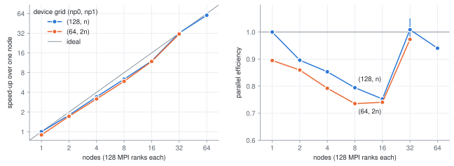

# Memory, layout and parallelization

How `dnsjax` lays its data out, what a configuration costs in memory,
and how the work is split across devices. All of it is independent of
the flow — the geometry sets the meaning of each axis, and the device
grid is chosen the same way for all ten systems. The last section
measures how one plane-channel run scales on a CPU cluster, from 1 to
64 nodes.

Start at the [README](../README.md) for the solver itself.

## Memory footprint

Every contribution below scales linearly with the point count
$n_x n_y n_z$ — nothing grows faster under the default backends — and the
total divides by $n_{p0} \cdot n_{p1}$ across devices. At the default double
precision one real number is 8 bytes, so a *field* of $n_x n_y n_z$ reals
occupies $n_x n_y n_z / 2^{27}$ GiB; that is the unit used below. Single
precision (`res.double_precision = false`) halves everything and roughly
doubles the throughput of the bandwidth-bound FFT stages on GPUs
(considerably more on consumer GPUs, which throttle double-precision
arithmetic), at reduced accuracy. Assuming the default 3/2 dealiasing and
the default backends:

- **Spectral state** — exactly $n_c$ fields, with $n_c = 3$ velocity
  components (9 for the viscoelastic flows, and 2 more for the pipe
  family — pipe, curved pipe, viscoelastic pipe — whose default time
  stepper carries two further fields across steps): one component is
  $(n_x/2) \cdot n_y \cdot (n_z - 1)$ complex numbers ($n_y - 1$ in place
  of $n_y$ for the periodic box), i.e.
  $\approx n_x n_y n_z$ reals. The time stepper holds about three further
  state-sized arrays within a step, and `cnab2` carries one across steps
  (for the wall-bounded systems its allocated peak still matches the
  default scheme's, whose corrector branch XLA keeps reserved).
- **Nonlinear term, every step** — the rotational form inverse-transforms a
  6-field batch (velocity + vorticity) to the oversampled grid, multiplies
  pointwise, and forward-transforms the 3 product fields (the curved
  pipe sends 8: its curvature terms ride the same batch rather than
  paying for transforms of their own). Counting the held
  fields, the products, and the one to two batch-sized intermediates inside
  the transforms, the working set is $W \approx 15\text{–}21$ oversampled
  fields; each oversampled field is $(3/2)^2 = 2.25$ fields for
  wall-bounded systems (the wall-normal direction is never oversampled) and
  $(3/2)^3 = 3.375$ fields for triply-periodic ones. How much of this
  coexists is decided by XLA's buffer reuse, so treat the upper end as the
  sizing estimate. The viscoelastic right-hand side instead transforms a
  36-field batch with 9 outputs, and `solver.rhs_transform_chunks = k` —
  the knob applies to every flow's batch, but bites here — cuts its
  transform-stage share $k$-fold at identical results. Both viscoelastic
  flows share that right-hand side.
- **Wall-normal operators** — the Pallas backend stores no-pivot banded LU
  factors: $(2p + 1) \cdot n_y$ reals per matrix per Fourier mode, with the
  half-bandwidth $p$ equal to `fd_order`, over the $(n_z - 1)(n_x/2)$ mode
  plane — that is $m (2p + 1)/2$ fields for $m$ banded matrices, the one
  term that grows with `fd_order`. Here $m = 2$ for
  plane-Couette/Poiseuille, $3$ for the pipe, curved pipe,
  Taylor–Couette, quasi-Keplerian, and Dean, and $9$ for the
  viscoelastic flows (the same $3$ plus the six conformation Helmholtz
  matrices), plus $v$ field-sized boundary-response vectors ($v/2$
  fields): $v = 2$, or $3$ for the pipe family. The legacy primitive
  scheme (`res.consistent_imm = false`) stores one more matrix in the
  curvilinear geometries and up to six response vectors. Switching to
  `solver.backend = "dense"` replaces $(2p + 1)$ by $n_y$ per matrix — the
  one super-linear option, and the reason Pallas is the wall-bounded
  default. (`solver.pallas_kernel` is a different axis: it selects which
  sweep reads the banded factors, not how they are stored, so it moves
  nothing here.) Triply-periodic systems store no matrices at all
  (their implicit solve is diagonal in spectral space), only four real
  coefficient arrays — wavenumber and inverse-Laplacian factors,
  $\approx 2$ fields.

Summing these, the leading-order total per device is

```math
\text{wall-bounded:} \qquad
  \Bigl[\, 4 n_c + \tfrac{9}{4} W +
    \tfrac{1}{2} \bigl( m (2p + 1) + v \bigr) \Bigr]
  \, \frac{n_x n_y n_z}{2^{27} \, n_{p0} n_{p1}} \ \text{GiB},
```

```math
\text{triply-periodic:} \qquad
  \Bigl[\, 4 n_c + \tfrac{27}{8} W + 2 \Bigr]
  \, \frac{n_x n_y n_z}{2^{27} \, n_{p0} n_{p1}} \ \text{GiB},
```

with $W \approx 15\text{–}21$ as above (for the viscoelastic flows,
$W \approx 45 + 72/k$ with $k$ = `rhs_transform_chunks`) and
$(n_c, m, v) = (3, 2, 2)$ for the plane flows, $(5, 3, 3)$ for the pipe
and the curved pipe, $(3, 3, 2)$ for Taylor–Couette, quasi-Keplerian,
and Dean, $(11, 9, 3)$ for the viscoelastic pipe, and $(9, 9, 2)$ for
viscoelastic Dean. The sum is an upper estimate —
XLA's buffer reuse typically realizes less — and halves at single
precision. Off the stepping path, a snapshot write reshards the state
onto an I/O layout before moving each device's bytes directly to disk
(staging through host memory only when GPUDirect Storage is
unavailable) — a transient second state-sized copy on multi-device
runs, nothing extra on a single device — and the on-device diagnostic
buffers are resolution-independent.

## Array layout by geometry

The solver keeps one internal axis order for every flow — physical
`[axis0, axis1, axis2]` and spectral `[axis0, axis1, axis2]` — and the
physical meaning of each axis is set by the geometry (a row per
geometry, not per flow). The leading axis is device-local; the two
sharded axes are split by `np0` and `np1` (elaborated under
[Parallelization](#parallelization)). Role abbreviations: **sw**
streamwise, **wn** wall-normal, **sh** shearwise, **sp** spanwise.

| Geometry | Velocity components `(0, 1, 2)` | Physical `[0, 1, 2]` | Spectral `[0, 1, 2]` | `np0` splits | `np1` splits |
|---|---|---|---|---|---|
| Triply-periodic (Kolmogorov) | $(u_x, u_y, u_z)$ = (sw, sh, sp) | $[y, z, x]$ | $[k_y, k_z, k_x]$ | $y$ / $k_z$ | $z$ / $k_x$ |
| Cartesian (plane-Poiseuille/Couette) | $(u_x, u_y, u_z)$ = (sw, wn, sp) | $[y, z, x]$ | $[y, k_z, k_x]$ | $y$ / $k_z$ | $z$ / $k_x$ |
| Cylindrical (pipe, curved pipe, viscoelastic pipe) | $(u_z, u_r, u_\theta)$ = (sw, wn, sp) | $[r, \theta, z]$ | $[r, k_\theta, k_z]$ | $r$ / $k_\theta$ | $\theta$ / $k_z$ |
| Annular (Taylor–Couette, quasi-Keplerian, Dean, viscoelastic Dean) | $(u_z, u_r, u_\theta)$ = (**sp**, wn, **sw**) | $[r, \theta, z]$ | $[r, k_\theta, k_z]$ | $r$ / $k_\theta$ | $\theta$ / $k_z$ |

Each `np0` / `np1` cell reads *physical axis* / *spectral axis*.
Velocity components are stored in `(streamwise, wall-normal, spanwise)`
order for every geometry **except the annulus**, which reuses the
pipe's axial-first $(u_z, u_r, u_\theta)$ order so the solver's shared,
right-handed curl / cross / finite-difference operators apply
unchanged. Because the annular main flow is azimuthal, its streamwise
velocity is component 2 ($u_\theta$) and its spanwise velocity is
component 0 ($u_z$) — the sole departure from the component-order
convention.

## Parallelization

The device grid is $(n_{p0}, n_{p1})$, and the two axes distribute the data
differently:

- **`np0`** splits the wall-normal axis ($y$ / $r$) in physical space and the
  spanwise / azimuthal wavenumber axis ($k_z$ / $m$) in spectral space. The
  split is padding-free when `np0` divides both the wall-normal point
  count (`ny`, or `nr`) and the stored mode count ($n_z - 1$, or
  $n_\theta - 1$); otherwise the layer zero-pads to the next multiple
  and strips the padding around the reshard (the stored mode count is
  odd, so a one-mode pad is the norm — and harmless).
- **`np1`** splits the spanwise / azimuthal axis ($z$ / $\theta$) in
  physical space and the streamwise / axial wavenumber axis ($k_x$) in
  spectral space. The spectral side is auto-padded the same way
  (padding-free when `np1` divides the streamwise / axial mode count,
  $n_x/2$ or $n_z/2$); on the physical side the oversampled size
  ($3/2 \times$ the base resolution of that axis at the default
  oversampling) is rounded up to the next FFT-friendly multiple of
  `np1` when needed (see
  [Spatial discretization](numerics.md#spatial-discretization)), which
  amounts to a sliver of extra oversampling.
- Independently of the device grid, the **Pallas banded solver** tiles each
  device's $(k_z, k_x)$ mode plane in blocks of
  (`solver.pallas_block_m0`, `solver.pallas_block_m1`) $= (2, 32)$ and pads
  up to whole tiles, so the padded modes cost memory and solve work in
  proportion to the round-up (what to do about it: *Choosing the device
  grid* below).

No divisibility choice is rejected, and none of the padding — for the
device grid or for FFT-friendly sizes — is silent: every adjustment is
reported by a one-line startup diagnostic, so its (usually marginal) cost
stays visible.

Crucially, **every device holds the full wall-normal extent in spectral
space**, so the per-mode banded solves need no communication. The forward and
inverse FFTs move data between layouts with two reshards implemented as a
`shard_map` with explicit `reshard` calls; with either grid axis at 1 the
decomposition collapses to a one-dimensional split and only the other
reshard remains. `jax.device_count()` must equal $n_{p0} \cdot n_{p1}$.

### Choosing the device grid

The two exchanges are not equivalent, which is what makes the choice
matter. The `np1` exchange ($z \leftrightarrow k_x$) runs while the array
still carries the **oversampled** spanwise extent, whereas the `np0`
exchange ($y \leftrightarrow k_z$) runs after the truncation to stored
modes — so at the default oversampling `np1` moves $3/2$ as many bytes.
And a second grid axis does not divide the first exchange more finely, it
**adds** a second one: a one-dimensional grid performs one exchange per
transform, a two-dimensional grid two, each a synchronization point. Both
the exchange count and its byte volume are visible in the compiled
program.

**Independently of the device type:**

1. **On one node, stay one-dimensional.** Split on `np0` by default:
   its exchange carries $2/3$ of the bytes, and its mode axis tiles far
   more coarsely on GPU. Split on `np1` instead when `ny` (`nr`) will
   not divide the device count or is too small for it.
2. **Across nodes, keep `np0` large as well.** The grid is laid out
   row-major over the devices ordered by node, so with `np1` dividing
   the devices per node the `np1` groups fall within a node, whatever
   order the launcher numbers the ranks in; a multi-node run prints how
   many nodes each group spans. Aligning the grid with the nodes
   (`np1` = devices per node, `np0` = number of nodes) would confine the
   heavier exchange to the node and leave the network $n_{p0} - 1$
   large messages per device in place of the many small ones a
   grid-wide exchange sends, at equal network volume. On CPU that
   argument loses to the first rule's. On
   [ARCHER2](#strong-scaling-on-archer2) (two 64-core AMD EPYC 7742
   and 16 DDR4-3200 channels per node, Slingshot between nodes; 128
   ranks per node, Cray MPICH) at `1280 x 383 x 384` the fastest grid
   on 1, 2 and 4 nodes was `(128, n)` — the largest `np0` dividing the
   rank count that pads the 383 wall-normal points by only the one
   point any split of them needs, the rest on `np1`, whose groups of
   `n` consecutive ranks still fall within a node — and the aligned
   `(n, 128)` the slowest that fit, 25 % behind on two nodes and 22 to
   25 % on four (on one node `(2, 64)` ran 30 % behind `(128, 1)`).
   `(128, n)` kept its lead to 32 nodes, the runner-up `(64, 2n)` 2 to
   8 % behind from 2 nodes on. Splitting on `np1` alone across nodes is
   the one arrangement to avoid: it puts the $3/2$-sized exchange on
   the network (`(1, 256)` did not fit in two ARCHER2 nodes' memory).
   Untested across GPU nodes.
3. **Snapshots follow the same pattern**, but only for the first
   reason: a one-dimensional grid reshards once per save instead of
   twice. Write granularity does not enter the choice — the reshard
   trims the divisibility padding as it goes, so every grid writes each
   component as one contiguous range per device.

**On CPU** the mode plane carries no tile round-up — the Pallas kernel
never runs — so `np1` may be taken as far as the mode count allows, and
one device per process makes $n_{p0} \cdot n_{p1}$ the rank count.
Measured at four and eight ranks, the per-exchange cost dominates its
volume: a two-dimensional grid costs 9 to 19 % against the best
one-dimensional one, where the $3/2$ volume difference between the two
one-dimensional grids is worth some 18 % of the transform itself but only
a few percent of the step around it. Routing the collectives through MPI
rather than `gloo` (see
[CPU collectives](cpu-collectives.md)) speeds up
every exchange, shifting weight from the per-exchange cost back toward
volume.

**On GPU** the mode plane is tiled, which makes `np1` the granular axis:
keep $(n_x/2)/n_{p1}$ a multiple of `solver.pallas_block_m1` $= 32$,
where $(n_z-1)/n_{p0}$ need only clear `pallas_block_m0` $= 2$. A
minimal-box `nx = 32` split four ways leaves four streamwise modes per
device, padded to 32 — lower the block size, or move the split to `np0`.
With a fast intra-node interconnect and production-sized arrays the
exchange is likelier to be limited by volume than by its per-exchange
cost, and that is the regime where `np0` moving $2/3$ of the bytes should
tell; comparing the two one-dimensional grids on the target machine is
then worth one pair of runs.

The production pipe run of [`running.md`](running.md#launching) on four
devices of one node, one-dimensionally:
`np0 = 4` splits the 48 radial points into 12 per device and the 95
stored azimuthal modes into 24, one padding mode included, leaving the
whole $n_z/2 = 256$ axial mode axis local (eight whole Pallas tiles):

```bash
# CPU: one device per process
mpirun -np 4 .venv/bin/dnsjax \
  --dist.np0 4 --dist.platform cpu \
  --phys.system pipe --phys.re 2300 --geo.lz 200 \
  --res.nz 512 --res.nr 48 --res.ntheta 96 \
  --init.localized_rolls True --stop.max_sim_time 500
```

```bash
# GPU: a single process addressing all four GPUs on the node, no MPI
.venv/bin/dnsjax \
  --dist.np0 4 --dist.platform cuda \
  --phys.system pipe --phys.re 2300 --geo.lz 200 \
  --res.nz 512 --res.nr 48 --res.ntheta 96 \
  --init.localized_rolls True --stop.max_sim_time 500
```

Because `np0 * np1` counts *devices* rather than processes, a single-node
multi-GPU run is most reliably launched as one process that addresses every
visible GPU; multi-node runs use one process per node spanning that node's
GPUs. The `Distribution` docstring in `parameters.py` covers the SLURM
launch details. The ranks discover each other from the launcher environment
where it says enough — the MPI implementation's rank variables plus a
coordinator address, taken from `JAX_COORDINATOR_ADDRESS`, else from
loopback when the whole job is on one node, the launcher's own daemon URI,
or the queueing system's node list (PBS, SLURM, LSF, Grid Engine) — and
otherwise from JAX's own cluster detection. That covers Open MPI 5, whose
PRRTE launcher drops the variable JAX's own Open MPI plugin looks for, and
the schedulers JAX has no plugin for; a site matching nothing is one
`JAX_COORDINATOR_ADDRESS` export away, and says so rather than failing
obscurely. A single-process launch coordinates nothing, so it starts no
distributed runtime and needs none of this — not even a launcher to be
detected in. On CPU, though, one process means one device: several CPU
devices in one process is oversubscription, and asking for it is refused
with the `mpirun -np N` that works.

A **CPU** run is pinned to one XLA thread per rank — a lone process
exactly like a rank of sixteen: the pool follows `NPROC`, which the run
sets only if unset, so `export NPROC=<n>` raises it. It also routes its
cross-process collectives through MPI when it finds the MPItrampoline
wrapper library (see [CPU collectives](cpu-collectives.md)), falling
back to `gloo` otherwise. The same docstring covers when raising
`NPROC` is worth doing.

### Target nodes

The rules above fix a run's shape. What they leave open — the rank
count on a CPU node, the grid axis and the Pallas tile on a GPU node,
the precision, how far the step scales across nodes — is measured on
the machine itself by
[`scripts/node_benchmark.py`](../scripts/node_benchmark.py). It launches
the ordinary solver on one fixed problem (the production configuration
with a short horizon) across every candidate layout, on one node or
several, and tabulates the seconds per time unit, the parallel
efficiency, the cost in node hours per time unit, the start-up time and
the peak memory, which the closing summary of every run reports: the
device's on GPU, the operating system's on CPU (`Peak host memory`, per
rank and for the fullest node). It also compares each row's `stats.dat`
with a reference — the first row, or a file kept from an earlier sweep
(`--stats-reference`) — so a sweep doubles as a check that every layout
computes the same run to round-off: `--stats-tolerance` fails a row that
does not, given a stats stream (`--outs.it_stats`) printed at
`--outs.stats_precision 17` from a deterministic start (a snapshot, or
a fixed `--init.random_seed`). The starting points below are
configuration, not measurements.

**A two-socket CPU node** (for example 2 × 64-core AMD EPYC 7742): one
rank per physical core, bound to it and running one XLA thread (the
default), with the collectives routed through MPI:

```bash
export MPITRAMPOLINE_LIB=/path/to/libmpiwrapper.so
mpirun -np 128 --map-by core --bind-to core -x MPITRAMPOLINE_LIB \
  .venv/bin/dnsjax --dist.platform cpu --dist.np0 <n0> --dist.np1 <n1> ...
```

These are Open MPI's binding flags. Under SLURM, launch with `srun`
and keep consecutive ranks on adjacent cores — the `np1` groups are
consecutive ranks, and the heavier exchange runs within them:

```bash
srun --ntasks-per-node 128 --cpus-per-task 1 --hint=nomultithread \
  --distribution=block:block .venv/bin/dnsjax ...
```

`--hint=nomultithread` gives each rank a physical core on a node with
hardware threads. To run fewer ranks per node, give each rank several
cores (`--ntasks-per-node 64 --cpus-per-task 2`, and
`export SRUN_CPUS_PER_TASK=$SLURM_CPUS_PER_TASK` where `srun` does not
inherit the job's value) rather than switching to a cyclic
distribution: both spread the ranks over every memory channel, but a
cyclic one also scatters each `np1` group across the node. A rank still
runs one XLA thread; the cores left over are what an underpopulated
node pays for more memory and memory bandwidth per rank. A complete job
script with this launch, the MPI wrapper, Spindle (below), a stop ahead
of the time limit and a per-node memory record is
[`examples/slurm/cpu.slurm`](../examples/slurm/cpu.slurm).

**Choose the grid against the padding.** A one-dimensional grid of 128
needs 128 to divide, or at least not badly overshoot, both axes it
splits — the wall-normal points and the stored spanwise modes for `np0`,
the streamwise modes and the oversampled spanwise points for `np1` — so
at production sizes the 128-rank candidates are often two-dimensional,
or split on `np1`. Divisibility padding inflates every array and idles
the ranks that hold only padding: at `1280 x 385 x 320` on 128 ranks,
`(128, 1)` pads the wall-normal axis from 385 to 512 points and the
stored spanwise modes from 319 to 384, while `(4, 32)` pads them to 388
and 320 and `(1, 128)` pads neither (its oversampled spanwise axis
rounds from 480 to 512 points). `node_benchmark.py --dry-run` prints
every layout's padding before anything runs.

**Size the node, not just the rank.** On a node of many cores and a few
GiB per core, every rank's own runtime — the interpreter, jaxlib, the
compiled programs, the MPI library's buffers — is multiplied by the
rank count, on top of the problem's share, and it is a large fraction
of the budget: about 0.45 GiB of private memory per rank for a
production plane-channel configuration on a workstation, before any
site MPI's own; on an [ARCHER2](#strong-scaling-on-archer2) node (two
64-core AMD EPYC 7742, 256 GB over 16 DDR4-3200 channels; Cray MPICH),
measured on a problem too small to matter, about 0.65 GiB per rank at
`(2, 64)` and 1.0 GiB at `(1, 128)` — 85 and 130 GiB of the node's
222 before the problem's own share. On the production run measured
there, a rank held about 1.1 GiB besides its share of the problem's
93.5 GiB while stepping at `(128, n)` (0.9 GiB at `(64, 2n)`) on up to
16 nodes, and more beyond: 1.2 GiB at 32 nodes and 1.3 at 64. One
process on the first node held some 70 KiB more per rank of the job on
top (0.57 GiB more at 8192 ranks). Three tools separate the two:
[`scripts/memory_budget.py`](../scripts/memory_budget.py) predicts the
problem's share per rank for any layout from XLA's own buffer
assignment, without the machine; the `Peak host memory` line of a run
reports what the operating system saw at the high-water mark, start-up
included, and the `Resident host memory` line under it what the run
still holds at the end; and
[`scripts/memory_watch.py`](../scripts/memory_watch.py) samples each
node's total during a job, so an out-of-memory kill is placed against
its layout and start-up phase. A layout that does not fit is helped, in
order, by less padding, by `solver.rhs_transform_chunks`, and by fewer
ranks per node.

**Wall-normal derivatives** run as stencils on CPU rather than as dense
$n_y \times n_y$ matrix products (`solver.wall_normal_matvec = "auto"`):
at the per-rank size of a `1280 x 385 x 320` run on 128 ranks that
removes three quarters of the step's floating-point work and about 15 %
of its time on one core of a laptop processor, at unchanged memory (the
measured table: the Design notes of
`src/dnsjax/geometries/wall_bounded/_base.py`).
`node_benchmark.py --variant gemm="--solver.wall_normal_matvec dense"`
measures the same trade on the target node, in one sweep.

**Across nodes**, start from the largest padding-free `np0` (rule 2 of
*Choosing the device grid*) and measure.
`node_benchmark.py --launcher srun --nodes 1 2 4 ...`, run inside the
allocation, measures the strong scaling of the production problem
directly — `--np0 128 64` keeps the `(128, n)` and `(64, 2n)` families
at every node count — and its `--exe` arms compare two checkouts in one
sweep. `node_benchmark.py --target cpu` runs every factorization at
each rank count (`--ranks 16 32 64 128` by default, or `--np0` /
`--np1` to keep a few), so the table also shows the rank count at
which the step stops scaling. Measure at the node counts you will run:
on ARCHER2 the cost of a step moved by a quarter between 16 and 32
nodes, for a reason no smaller run shows
([Strong scaling on ARCHER2](#strong-scaling-on-archer2), which also
gives a one-node test that tells a per-rank effect from the
network's).

**Start-up on many nodes.** Every rank imports some 800 Python modules
from the shared filesystem — close to a thousand file opens and
directory listings per rank, more with the metadata lookups behind them —
so on tens of full nodes the start-up is a burst that a parallel
filesystem's metadata server serves slowly, and at every user's expense.
Where the site offers a tool that has one process per node fetch the
files for its ranks (Spindle, for one),
`node_benchmark.py --launch-prefix` runs a sweep under it. On ARCHER2,
Spindle cut the time from launch to a running distributed runtime from
59 to 25 s on two nodes, at no cost per step; under it that phase
stayed under a minute on up to 64 nodes (a job's first launch the
slowest), and the solver's own set-up took a further 70 to 120 s at
every node count. Compile the bytecode once after each update — the
environment's with `uv sync --compile-bytecode` (uv otherwise leaves it
to the first import), the checkout's own with
`python -m compileall src` — and keep the ranks from writing theirs
(`PYTHONDONTWRITEBYTECODE=1`): a module left uncompiled is then
compiled in memory by every rank, at every start.

**A four-GPU node** (for example 4 × NVIDIA H200): one process addressing
all four GPUs, no launcher:

```bash
.venv/bin/dnsjax --dist.platform cuda --dist.np0 4 ...
```

- **Grid.** `np0 = 4` is rule 1's default; `np1 = 4` is the alternative
  worth one pair of runs, and `node_benchmark.py --target gpu` adds the
  2 × 2 grid.
- **Memory.** JAX reserves `XLA_PYTHON_CLIENT_MEM_FRACTION` of each GPU
  at start-up (0.75 by default) and allocates inside it. Size the run
  with the model under [Memory footprint](#memory-footprint), and raise
  the fraction (`export XLA_PYTHON_CLIENT_MEM_FRACTION=0.9`) when it
  needs more of the device. `solver.rhs_transform_chunks` shrinks the
  transform transient at the cost of more FFT dispatches, which makes it
  the knob for a run that does not fit — chiefly the viscoelastic flows.
- **Pallas tile.** The defaults (2, 32) were tuned on an H100 SXM, which
  has the same 132 streaming multiprocessors as an H200 but less memory
  bandwidth (3.35 against 4.8 TB/s), so they are where a `--tiles` sweep
  starts rather than a result for the H200.
  [`scripts/pallas_solve_profile.py`](../scripts/pallas_solve_profile.py)
  breaks a solve down against the device's own peak bandwidth.
- **Precision.** Single precision halves every figure under
  [Memory footprint](#memory-footprint);
  `node_benchmark.py --precisions double single` puts the two side by
  side.

## Strong scaling on ARCHER2

One production-sized run, timed on 1 to 64 nodes of a CPU cluster with
[`scripts/node_benchmark.py`](../scripts/node_benchmark.py).

**The machine.** A standard compute node of
[ARCHER2](https://docs.archer2.ac.uk/user-guide/hardware/), an HPE Cray
EX system, as the site's documentation described it on 7 October 2026:

- **Processors:** two AMD EPYC 7742 (Zen 2, "Rome"), 64 cores each,
  2.25 GHz nominal, run at the site's default cap of 2.0 GHz, which
  leaves boost off. Each core has two hardware threads; the runs used
  one.
- **Caches:** 32 KiB of L1 data and 512 KiB of L2 per core, and 16 MiB
  of L3 per complex of four cores (256 MiB per socket). A socket is
  eight dies of two such complexes around one I/O die.
- **Memory:** 256 GB over eight DDR4-3200 channels per socket (one
  16 GB DIMM each, 204.8 GB/s peak per socket), in eight NUMA regions
  of 16 cores (NPS4). A job step could use 222 GiB of it.
- **Within a socket:** AMD's Infinity Fabric, 32 bytes read and 16
  written per fabric clock (at most 1467 MHz) from die to die.
- **Between the two sockets:** three xGMI links of 16 PCIe lanes each
  at 16 GT/s: 96 GB/s per direction in theory, 63.5 to 72 GB/s
  sustained.
- **Between nodes:** HPE Slingshot, two 100 Gb/s ports per node, in a
  dragonfly: groups of 128 nodes on 16 switches, connected all-to-all
  by electrical links within a group and by optical ones between
  groups.
- **MPI:** Cray MPICH 8.1.27 over libfabric's `verbs` provider, reached
  through MPItrampoline ([CPU collectives](cpu-collectives.md)).

**The run.** Plane-Poiseuille flow at $Re = 14000$ under a constant
bulk velocity ($Re_\tau \approx 550$ in the state used), in an
$8\pi \times 2 \times \pi$ box at $1280 \times 383 \times 384$, which
is $1920 \times 383 \times 576$ points on the oversampled grid, in
double precision. It steps from one turbulent state at a fixed
$\Delta t = 0.0025$ with the default predictor–corrector, which here
converges at its first correction on every step: two right-hand-side
evaluations a step. One MPI rank per core, each running one XLA
thread, on whole nodes, placed by
`srun --distribution=block:block --hint=nomultithread`.

**The measurement.** Each run steps for 7 to 12 minutes of wall time,
start-up included, timed from the end of its first (compiling) step. A
point is the mean of two or three runs, each on its own allocation; a
run that its repeats did not reproduce is left out. Every run
reproduces the same trajectory: its statistics match a reference
run's to round-off.

<picture>
  <source media="(prefers-color-scheme: dark)"
          srcset="figures/archer2-scaling-dark.svg">
  
</picture>

Speed-up and efficiency are against the fastest one-node run,
`(128, 1)`; the figure's bars span the runs behind each point
([`scripts/scaling_figure.py`](../scripts/scaling_figure.py) draws it,
and these tables, from
[`figures/archer2-scaling.csv`](figures/archer2-scaling.csv)).

| nodes | ranks | `(128, n)`: s per time unit | speed-up | efficiency | node hours per time unit | `(64, 2n)`: s per time unit |
|---:|---:|---:|---:|---:|---:|---:|
| 1 | 128 | 2708.5 | 1.00 | 1.00 | 0.75 | 3027.0 |
| 2 | 256 | 1511.5 | 1.79 | 0.90 | 0.84 | 1575.5 |
| 4 | 512 | 793.7 | 3.41 | 0.85 | 0.88 | 854.8 |
| 8 | 1024 | 426.3 | 6.35 | 0.79 | 0.95 | 460.3 |
| 16 | 2048 | 224.9 | 12.0 | 0.75 | 1.00 | 228.6 |
| 32 | 4096 | 83.91 | 32.3 | 1.01 | 0.75 | 87.00 |
| 64 | 8192 | 45.01 | 60.2 | 0.94 | 0.80 | — |

`(128, n)`, the grid of rule 2, leads `(64, 2n)` at every node count:
by 12 % on one node and by 2 to 8 % from 2 to 32 nodes. (`(64, 128)`,
the next grid of that family, pads the spanwise axis and was not run.)
Its efficiency falls to 0.75 by 16 nodes, returns to 1.01 at 32, and
is 0.94 at 64. The runs spread most at 32 nodes, from 80.6 to 86.5
seconds per time unit, an efficiency of 0.98 to 1.05.

**Why 32 nodes cost what one does.** From 16 to 32 nodes the time per
unit falls 2.7-fold, for half the work per rank. The fall belongs to
the rank, not to the network. One node running the same problem at
`nx = 1280/N` gives each of its ranks the spectral block of the
`N`-node run, and the same spanwise-transform stage, with no traffic
between nodes; it shows the same fall from `N = 16` to 32, 2.71-fold
after 1.96 and 1.98 for the halvings before. Set against those runs,
each `N`-node time splits into a per-rank factor (the one-node time
times `N`, against the full problem on one node) and an off-node factor
(the `N`-node time over the one-node one), whose product is the
node-hour cost against one node:

| N | one node, `nx = 1280/N`: s per time unit | per-rank factor | N nodes: s per time unit | off-node factor |
|---:|---:|---:|---:|---:|
| 4 | 677.1 | 1.00 | 793.7 | 1.17 |
| 8 | 345.4 | 1.02 | 426.3 | 1.23 |
| 16 | 174.7 | 1.03 | 224.9 | 1.29 |
| 32 | 64.48 | 0.76 | 83.91 | 1.30 |
| 64 | 26.30 | 0.62 | 45.01 | 1.71 |

The per-rank cost holds within 3 % up to the block of 16 nodes, falls
by a quarter at 32 and further at 64; the off-node factor grows
smoothly to 1.30 at 32 nodes, then to 1.71 at 64. At 32 nodes the two
nearly cancel, $0.76 \times 1.30 = 0.99$: that, not a free network, is
why the run costs what one node does. The off-node factor holds more
than the network: the `np1` exchange, absent from `(128, 1)` on one
node, and the full-length streamwise transform.

The compiled step is the same program at both sizes: its optimized
HLO differs only in how the `np1` exchange is packed (one piece per
peer) and in one small reduction. The fall also shows in `(64, 2n)`,
whose `np0` exchange sends each peer twice as many bytes. So the same
work runs faster on a smaller block. That is consistent with each
rank's working set starting to fit in cache — one spectral field per
rank is 720 KiB at 16 nodes and 360 KiB at 32, against 512 KiB of L2
per core — though no hardware counters were read to show it.

**What it means for a run.** Measure at the node counts you will run:
the cost per step moved by a quarter between 16 and 32 nodes, which no
smaller run would have shown. The one-node test above tells a per-rank
effect from the network's on any machine. With a `parameters.toml` that
names no `[init] snapshot` (a smaller `nx` starts a new trajectory
anyway), inside a one-node allocation:

```bash
.venv/bin/python scripts/node_benchmark.py --target cpu \
  --launcher srun --nodes 1 --tasks-per-node 128 --np0 128 \
  --toml parameters.toml \
  --variant n16="--res.nx 80" --variant n32="--res.nx 40" \
  --solver-args "--init.random_seed 1 --stop.max_wall_time PT3M30S"
```

Compare each row's seconds per time unit, times its `N`, with the
full problem's on one node.
