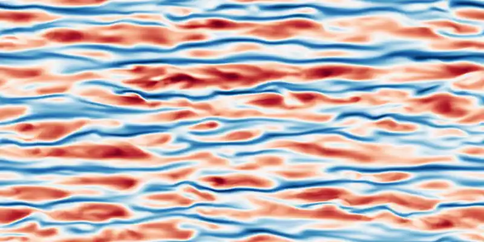

# Snapshots and external data access

The on-disk format, how a run resumes from one, the NumPy-only reading
API, and the importer that packs a field produced elsewhere into a valid
snapshot. Start at the [README](../README.md) for the solver itself.

## The format

A snapshot is a **single uncompressed tar archive** (format version 6)
wrapping a **zarr3** store, a JSON metadata member (parameters, grid,
lineage, and the writing code's git revision), and one contiguous chunk
per state component (three velocity components, or nine for the
viscoelastic flows). Each chunk is stored **in the solver's native
spectral layout** at true (unpadded) mode counts — saving, loading, and
reading never transpose — and in **physical components** for every
geometry: the cylindrical and annular families convert from the
solver's decoupled $u_\pm$/spin working basis at the write/read
boundary. The embedded parameters are the flow-relevant,
resolved values under their public names — the same representation the
startup printout and `--sample-toml` use; snapshots written before
format version 6 embed a different layout, basis, or representation and
are rejected rather than translated. A write first reshards the state,
inside `jit`, onto the file's own layout — a contiguous wall-normal
slab per device, at the true mode counts, so the padding never reaches
the file — and each device then writes its disjoint byte ranges, one
per component, into the one file in parallel: directly between GPU
memory and disk when GPUDirect Storage is available, through the host
otherwise, with a
concurrent mode for POSIX/parallel filesystems and a rank-ordered
serial mode for filesystems where concurrent writes are unsafe. The
bytes land in `<name>.tar.partial` and are renamed into place only once
complete, so a killed job leaves the previous snapshot intact and never
a truncated archive that could pass for a valid one; on read, the chunk
layout is checked against the metadata, and a damaged archive raises an
error naming the file and the cause.
### What is stored

The stored field is the spectral **perturbation** $\mathbf{u}'$ for the
base-flow systems (the laminar state is a zero array) and the **total**
field for Dean, viscoelastic Dean, and the viscoelastic pipe. The archive
is readable with ordinary tools — `tar xf` yields a valid zarr3 store,
and in the worst case each
chunk is raw little-endian complex data for `numpy.fromfile`. Resume is
agnostic to the device count (precision must match — a mismatch
rejects), and re-grids **every changed axis** on load: the wall-normal
grid by interpolation — spectrally when both grids are CGL-family, by a
local order-`fd_order` stencil for tanh or custom grids — and each
Fourier axis by inserting or dropping modes at its high-wavenumber end,
so a state can be picked up at a different resolution (which, being a
`res` change, starts a new trajectory rather than continuing one).
### Resume and re-gridding

`stop.max_sim_time` is a horizon measured from the run's own initial
condition rather than an absolute clock reading, so a resume asks for
that much *more* integration whatever time the snapshot carries — one
value serves an ensemble whose members were harvested at different
times. A run split across several launches therefore gets the whole
horizon again at each one; a fixed absolute end time is expressed by
shortening `max_sim_time` on the resume.

## Reading a snapshot without JAX

For post-processing, `dnsjax.analysis.snapshot_export.read_state` reads a
snapshot into NumPy arrays **without importing JAX or the solver runtime**,
pulling only the requested data off disk:

```python
from dnsjax.analysis.snapshot_export import read_state

data = read_state("state00001.tar")   # NumPy only — no JAX, no solver
u_z, u_r, u_theta = data.physical     # pipe: real fields, native (r, θ, z)
r, theta, z = data.physical_coords    # matching coordinate arrays
re = data.params.phys.re              # embedded parameters

# Cartesian systems return (u_x, u_y, u_z) in the native (y, z, x) layout:
u_x, u_y, u_z = read_state("state00002.tar").physical

# Select components, read just two wall-normal slabs off disk, and also
# return the spectral coefficients:
data = read_state(
    "state00001.tar",
    components=(0,),
    wall_normal_points=(0.2, 0.8),
    return_spectral=True,
)
```

Both README figures are made this way — no JAX, no solver runtime, just
a snapshot and NumPy (`scripts/snapshot_figure.py`):

<a id="fig-streaks"></a>
<p align="center">
  
</p>
<p align="center"><em>
Streamwise velocity fluctuations in turbulent channel flow at
Re<sub>&tau;</sub> &asymp; 180, in a 4&pi; &times; 2&pi; box, over 10
advective time units: the wall-parallel plane at
<i>y</i> = &minus;0.917, <i>y</i><sup>+</sup> = 14.9.<br>
<a href="../README.md#fig-planes">&#128279;&nbsp;See three planes
stacked in a 3D view.</a>
</em></p>

The companion `dnsjax.analysis.snapshot_ops` module provides `derivative`,
`gradient`, `divergence`, `curl`, and `integrate` that reproduce the
solver's *discrete* operators node-for-node, plus `to_physical` and
`to_spectral` for moving a field between the two representations.

Four more names round out the JAX-free API for the cases where the
field data is not what you are after. `read_meta` returns a snapshot's
parsed metadata — resolution, grid, clock, lineage, the writing code's
git revision — and `read_stats` the physical diagnostics of the state
itself, which every snapshot carries as its own archive member unless
`outs.snapshot_embed_stats` is turned off.
`geometry_info` turns those parameters into the per-geometry axis and
component schema, and `Namespace` is the read-only view they are
returned through: it gives attribute access (`params.phys.re`) and item
access side by side, the latter for stats keys such as `E'` or
`tau'_s,b` that are not valid Python identifiers.

## Importing a field from elsewhere

`dnsjax.analysis.snapshot_import` covers the reverse direction: packing
a velocity field produced elsewhere (by another simulator, say) into a
valid snapshot — velocity flows only, the nine-component viscoelastic
state being readable but not importable.

The importer is a library (not a CLI) and **assumes the field is already
in dnsjax's native layout**: components leading, axes $(y, z, x)$ for the
Cartesian and triply-periodic systems and $(r, \theta, z)$ for the
cylindrical and annular flows (pipe, Taylor–Couette, quasi-Keplerian,
Dean) — whose components are $(u_z, u_r, u_\theta)$ — so any axis
permutation and component reordering from the source code's conventions
is the caller's first step.
Two conventions to keep in mind. The resolutions are the solver's
nominal (physical) mode counts *without* the 3/2 dealiasing expansion —
never include dealiasing zero-padding in the field or the resolution
parameters — and every Fourier count must be **even**, so resample an
odd-sized source axis before importing it. And every wall-bounded flow needs its wall-normal/radial
grid points, **ascending** in dnsjax's convention: bottom wall $-1$ to
top wall $+1$ (Cartesian), near-axis to the outer wall on $(0, 1]$
(pipe), inner to outer radius (Taylor–Couette); the triply-periodic
systems take no grid. Parameters go by the flow's public names, exactly
as on the CLI:

```python
import numpy as np

from dnsjax.analysis.snapshot_import import convert_field_to_snapshot

# Plane-Couette: perturbation u' with components (u_x, u_y, u_z) over
# native axes (y, z, x) — shape (3, ny, nz, nx) — already in dnsjax's
# layout, sampled on the ascending wall-normal grid ys of length ny.
u = np.load("external_field.npy")           # (3, 65, 128, 128)
ys = -np.cos(np.linspace(0.0, np.pi, 65))   # CGL: -1 (bottom) → +1 (top)
convert_field_to_snapshot(
    u, "ic_plane_couette.tar",
    system="plane-couette", nx=128, ny=65, nz=128,
    lx=4.0, lz=4.0, wall_normal_grid=ys, re=400.0,
    space="physical",
)

# Pipe: (u_z, u_r, u_θ) over (r, θ, z), shape (3, nr, ntheta, nz); lz
# is the axial period (the sole free length — the azimuthal extent is
# the wedge 2π/m0), and rs ascends over the radii on (0, 1].
convert_field_to_snapshot(
    u_pipe, "ic_pipe.tar",
    system="pipe", nz=96, nr=49, ntheta=128,
    lz=6.0, m0=1, wall_normal_grid=rs, re=3000.0,
    space="physical",
)

# Taylor-Couette: same layout and resolution names as the pipe, driven
# by re1/re2/eta; rs_tc ascends from r_in = η/(1−η) to r_out = 1/(1−η).
convert_field_to_snapshot(
    u_tc, "ic_taylor_couette.tar",
    system="taylor-couette", nz=64, nr=49, ntheta=128,
    lz=4.0, wall_normal_grid=rs_tc,
    re1=400.0, re2=-200.0, eta=0.875,
    space="physical",
)
```

`space="spectral"` accepts already-transformed input in the same axis
order, with one restriction on where the half spectrum may sit: only the
**last** axis (the streamwise `nx` / axial `nz` slot) is the real-FFT
axis, holding the `nx//2` non-negative modes (Nyquist optional, dropped);
the other Fourier axes must carry full two-sided spectra, and
`input_norm` names the source's FFT normalization. A source that
`rfft`-ed a different axis must be permuted so its half axis lands last.
The result is an ordinary snapshot: start a run from it with
`--init.snapshot ic_plane_couette.tar` (a wall-normal grid differing from
the run's is re-gridded at load).
